# Projects and dependencies analysis

This document provides a comprehensive overview of the projects and their dependencies in the context of upgrading to .NETCoreApp,Version=v10.0.

## Table of Contents

- [Executive Summary](#executive-Summary)
  - [Highlevel Metrics](#highlevel-metrics)
  - [Projects Compatibility](#projects-compatibility)
  - [Package Compatibility](#package-compatibility)
  - [API Compatibility](#api-compatibility)
- [Aggregate NuGet packages details](#aggregate-nuget-packages-details)
- [Top API Migration Challenges](#top-api-migration-challenges)
  - [Technologies and Features](#technologies-and-features)
  - [Most Frequent API Issues](#most-frequent-api-issues)
- [Projects Relationship Graph](#projects-relationship-graph)
- [Project Details](#project-details)

  - [projects\Gibbed.Frostbite3.Common\Gibbed.Frostbite3.Common.csproj](#projectsgibbedfrostbite3commongibbedfrostbite3commoncsproj)
  - [projects\Gibbed.Frostbite3.ConvertDbObject\Gibbed.Frostbite3.ConvertDbObject.csproj](#projectsgibbedfrostbite3convertdbobjectgibbedfrostbite3convertdbobjectcsproj)
  - [projects\Gibbed.Frostbite3.Dynamic\Gibbed.Frostbite3.Dynamic.csproj](#projectsgibbedfrostbite3dynamicgibbedfrostbite3dynamiccsproj)
  - [projects\Gibbed.Frostbite3.GeneratePartitionMap\Gibbed.Frostbite3.GeneratePartitionMap.csproj](#projectsgibbedfrostbite3generatepartitionmapgibbedfrostbite3generatepartitionmapcsproj)
  - [projects\Gibbed.Frostbite3.ResourceFormats\Gibbed.Frostbite3.ResourceFormats.csproj](#projectsgibbedfrostbite3resourceformatsgibbedfrostbite3resourceformatscsproj)
  - [projects\Gibbed.Frostbite3.Unbundling\Gibbed.Frostbite3.Unbundling.csproj](#projectsgibbedfrostbite3unbundlinggibbedfrostbite3unbundlingcsproj)
  - [projects\Gibbed.Frostbite3.UnpackInitFS\Gibbed.Frostbite3.UnpackInitFS.csproj](#projectsgibbedfrostbite3unpackinitfsgibbedfrostbite3unpackinitfscsproj)
  - [projects\Gibbed.Frostbite3.UnpackPartitions\Gibbed.Frostbite3.UnpackPartitions.csproj](#projectsgibbedfrostbite3unpackpartitionsgibbedfrostbite3unpackpartitionscsproj)
  - [projects\Gibbed.Frostbite3.UnpackResources\Gibbed.Frostbite3.UnpackResources.csproj](#projectsgibbedfrostbite3unpackresourcesgibbedfrostbite3unpackresourcescsproj)
  - [projects\Gibbed.Frostbite3.VfsFormats\Gibbed.Frostbite3.VfsFormats.csproj](#projectsgibbedfrostbite3vfsformatsgibbedfrostbite3vfsformatscsproj)
  - [projects\Gibbed.Frostbite3.Zstd\Gibbed.Frostbite3.Zstd.csproj](#projectsgibbedfrostbite3zstdgibbedfrostbite3zstdcsproj)
  - [projects\Gibbed.IO\Gibbed.IO.csproj](#projectsgibbediogibbediocsproj)
  - [projects\Gibbed.MassEffectAndromeda.Dumping\Gibbed.MassEffectAndromeda.Dumping.csproj](#projectsgibbedmasseffectandromedadumpinggibbedmasseffectandromedadumpingcsproj)
  - [projects\Gibbed.MassEffectAndromeda.DumpItemTypes\Gibbed.MassEffectAndromeda.DumpItemTypes.csproj](#projectsgibbedmasseffectandromedadumpitemtypesgibbedmasseffectandromedadumpitemtypescsproj)
  - [projects\Gibbed.MassEffectAndromeda.DumpPartyMembers\Gibbed.MassEffectAndromeda.DumpPartyMembers.csproj](#projectsgibbedmasseffectandromedadumppartymembersgibbedmasseffectandromedadumppartymemberscsproj)
  - [projects\Gibbed.MassEffectAndromeda.DumpPlotFlags\Gibbed.MassEffectAndromeda.DumpPlotFlags.csproj](#projectsgibbedmasseffectandromedadumpplotflagsgibbedmasseffectandromedadumpplotflagscsproj)
  - [projects\Gibbed.MassEffectAndromeda.FileFormats\Gibbed.MassEffectAndromeda.FileFormats.csproj](#projectsgibbedmasseffectandromedafileformatsgibbedmasseffectandromedafileformatscsproj)
  - [projects\Gibbed.MassEffectAndromeda.GameInfo\Gibbed.MassEffectAndromeda.GameInfo.csproj](#projectsgibbedmasseffectandromedagameinfogibbedmasseffectandromedagameinfocsproj)
  - [projects\Gibbed.MassEffectAndromeda.SaveEdit\Gibbed.MassEffectAndromeda.SaveEdit.csproj](#projectsgibbedmasseffectandromedasaveeditgibbedmasseffectandromedasaveeditcsproj)
  - [projects\Gibbed.MassEffectAndromeda.SaveFormats\Gibbed.MassEffectAndromeda.SaveFormats.csproj](#projectsgibbedmasseffectandromedasaveformatsgibbedmasseffectandromedasaveformatscsproj)
  - [projects\Gibbed.PortableExecutable\Gibbed.PortableExecutable.csproj](#projectsgibbedportableexecutablegibbedportableexecutablecsproj)
  - [projects\NDesk.Options\NDesk.Options.csproj](#projectsndeskoptionsndeskoptionscsproj)


## Executive Summary

### Highlevel Metrics

| Metric | Count | Status |
| :--- | :---: | :--- |
| Total Projects | 22 | All require upgrade |
| Total NuGet Packages | 7 | 2 need upgrade |
| Total Code Files | 354 |  |
| Total Code Files with Incidents | 78 |  |
| Total Lines of Code | 35520 |  |
| Total Number of Issues | 651 |  |
| Estimated LOC to modify | 605+ | at least 1.7% of codebase |

### Projects Compatibility

| Project | Target Framework | Difficulty | Package Issues | API Issues | Est. LOC Impact | Description |
| :--- | :---: | :---: | :---: | :---: | :---: | :--- |
| [projects\Gibbed.Frostbite3.Common\Gibbed.Frostbite3.Common.csproj](#projectsgibbedfrostbite3commongibbedfrostbite3commoncsproj) | net48 | 🟢 Low | 0 | 0 |  | ClassicClassLibrary, Sdk Style = False |
| [projects\Gibbed.Frostbite3.ConvertDbObject\Gibbed.Frostbite3.ConvertDbObject.csproj](#projectsgibbedfrostbite3convertdbobjectgibbedfrostbite3convertdbobjectcsproj) | net48 | 🟢 Low | 0 | 1 | 1+ | ClassicDotNetApp, Sdk Style = False |
| [projects\Gibbed.Frostbite3.Dynamic\Gibbed.Frostbite3.Dynamic.csproj](#projectsgibbedfrostbite3dynamicgibbedfrostbite3dynamiccsproj) | net48 | 🟢 Low | 0 | 0 |  | ClassicClassLibrary, Sdk Style = False |
| [projects\Gibbed.Frostbite3.GeneratePartitionMap\Gibbed.Frostbite3.GeneratePartitionMap.csproj](#projectsgibbedfrostbite3generatepartitionmapgibbedfrostbite3generatepartitionmapcsproj) | net48 | 🟢 Low | 0 | 1 | 1+ | ClassicDotNetApp, Sdk Style = False |
| [projects\Gibbed.Frostbite3.ResourceFormats\Gibbed.Frostbite3.ResourceFormats.csproj](#projectsgibbedfrostbite3resourceformatsgibbedfrostbite3resourceformatscsproj) | net48 | 🟢 Low | 0 | 0 |  | ClassicClassLibrary, Sdk Style = False |
| [projects\Gibbed.Frostbite3.Unbundling\Gibbed.Frostbite3.Unbundling.csproj](#projectsgibbedfrostbite3unbundlinggibbedfrostbite3unbundlingcsproj) | net48 | 🟢 Low | 0 | 1 | 1+ | ClassicClassLibrary, Sdk Style = False |
| [projects\Gibbed.Frostbite3.UnpackInitFS\Gibbed.Frostbite3.UnpackInitFS.csproj](#projectsgibbedfrostbite3unpackinitfsgibbedfrostbite3unpackinitfscsproj) | net48 | 🟢 Low | 0 | 1 | 1+ | ClassicDotNetApp, Sdk Style = False |
| [projects\Gibbed.Frostbite3.UnpackPartitions\Gibbed.Frostbite3.UnpackPartitions.csproj](#projectsgibbedfrostbite3unpackpartitionsgibbedfrostbite3unpackpartitionscsproj) | net48 | 🟢 Low | 0 | 1 | 1+ | ClassicDotNetApp, Sdk Style = False |
| [projects\Gibbed.Frostbite3.UnpackResources\Gibbed.Frostbite3.UnpackResources.csproj](#projectsgibbedfrostbite3unpackresourcesgibbedfrostbite3unpackresourcescsproj) | net48 | 🟢 Low | 0 | 1 | 1+ | ClassicDotNetApp, Sdk Style = False |
| [projects\Gibbed.Frostbite3.VfsFormats\Gibbed.Frostbite3.VfsFormats.csproj](#projectsgibbedfrostbite3vfsformatsgibbedfrostbite3vfsformatscsproj) | net48 | 🟢 Low | 0 | 0 |  | ClassicClassLibrary, Sdk Style = False |
| [projects\Gibbed.Frostbite3.Zstd\Gibbed.Frostbite3.Zstd.csproj](#projectsgibbedfrostbite3zstdgibbedfrostbite3zstdcsproj) | net48 | 🟢 Low | 0 | 0 |  | ClassicClassLibrary, Sdk Style = False |
| [projects\Gibbed.IO\Gibbed.IO.csproj](#projectsgibbediogibbediocsproj) | net40 | 🟢 Low | 0 | 0 |  | ClassicClassLibrary, Sdk Style = False |
| [projects\Gibbed.MassEffectAndromeda.Dumping\Gibbed.MassEffectAndromeda.Dumping.csproj](#projectsgibbedmasseffectandromedadumpinggibbedmasseffectandromedadumpingcsproj) | net48 | 🟢 Low | 0 | 1 | 1+ | ClassicClassLibrary, Sdk Style = False |
| [projects\Gibbed.MassEffectAndromeda.DumpItemTypes\Gibbed.MassEffectAndromeda.DumpItemTypes.csproj](#projectsgibbedmasseffectandromedadumpitemtypesgibbedmasseffectandromedadumpitemtypescsproj) | net48 | 🟢 Low | 0 | 0 |  | ClassicDotNetApp, Sdk Style = False |
| [projects\Gibbed.MassEffectAndromeda.DumpPartyMembers\Gibbed.MassEffectAndromeda.DumpPartyMembers.csproj](#projectsgibbedmasseffectandromedadumppartymembersgibbedmasseffectandromedadumppartymemberscsproj) | net48 | 🟢 Low | 0 | 0 |  | ClassicDotNetApp, Sdk Style = False |
| [projects\Gibbed.MassEffectAndromeda.DumpPlotFlags\Gibbed.MassEffectAndromeda.DumpPlotFlags.csproj](#projectsgibbedmasseffectandromedadumpplotflagsgibbedmasseffectandromedadumpplotflagscsproj) | net48 | 🟢 Low | 0 | 1 | 1+ | ClassicDotNetApp, Sdk Style = False |
| [projects\Gibbed.MassEffectAndromeda.FileFormats\Gibbed.MassEffectAndromeda.FileFormats.csproj](#projectsgibbedmasseffectandromedafileformatsgibbedmasseffectandromedafileformatscsproj) | net48 | 🟢 Low | 0 | 0 |  | ClassicClassLibrary, Sdk Style = False |
| [projects\Gibbed.MassEffectAndromeda.GameInfo\Gibbed.MassEffectAndromeda.GameInfo.csproj](#projectsgibbedmasseffectandromedagameinfogibbedmasseffectandromedagameinfocsproj) | net48 | 🟢 Low | 0 | 0 |  | ClassicClassLibrary, Sdk Style = False |
| [projects\Gibbed.MassEffectAndromeda.SaveEdit\Gibbed.MassEffectAndromeda.SaveEdit.csproj](#projectsgibbedmasseffectandromedasaveeditgibbedmasseffectandromedasaveeditcsproj) | net48 | 🟡 Medium | 2 | 597 | 597+ | ClassicWpf, Sdk Style = False |
| [projects\Gibbed.MassEffectAndromeda.SaveFormats\Gibbed.MassEffectAndromeda.SaveFormats.csproj](#projectsgibbedmasseffectandromedasaveformatsgibbedmasseffectandromedasaveformatscsproj) | net48 | 🟢 Low | 0 | 0 |  | ClassicClassLibrary, Sdk Style = False |
| [projects\Gibbed.PortableExecutable\Gibbed.PortableExecutable.csproj](#projectsgibbedportableexecutablegibbedportableexecutablecsproj) | net40 | 🟢 Low | 0 | 0 |  | ClassicClassLibrary, Sdk Style = False |
| [projects\NDesk.Options\NDesk.Options.csproj](#projectsndeskoptionsndeskoptionscsproj) | net35 | 🟢 Low | 0 | 0 |  | ClassicClassLibrary, Sdk Style = False |

### Package Compatibility

| Status | Count | Percentage |
| :--- | :---: | :---: |
| ✅ Compatible | 5 | 71.4% |
| ⚠️ Incompatible | 2 | 28.6% |
| 🔄 Upgrade Recommended | 0 | 0.0% |
| ***Total NuGet Packages*** | ***7*** | ***100%*** |

### API Compatibility

| Category | Count | Impact |
| :--- | :---: | :--- |
| 🔴 Binary Incompatible | 457 | High - Require code changes |
| 🟡 Source Incompatible | 118 | Medium - Needs re-compilation and potential conflicting API error fixing |
| 🔵 Behavioral change | 30 | Low - Behavioral changes that may require testing at runtime |
| ✅ Compatible | 17612 |  |
| ***Total APIs Analyzed*** | ***18217*** |  |

## Aggregate NuGet packages details

| Package | Current Version | Suggested Version | Projects | Description |
| :--- | :---: | :---: | :--- | :--- |
| Caliburn.Micro | 5.0.258 | 4.0.230 | [Gibbed.MassEffectAndromeda.SaveEdit.csproj](#projectsgibbedmasseffectandromedasaveeditgibbedmasseffectandromedasaveeditcsproj) | ⚠️NuGet package is incompatible |
| Caliburn.Micro.Core | 5.0.258 |  | [Gibbed.MassEffectAndromeda.SaveEdit.csproj](#projectsgibbedmasseffectandromedasaveeditgibbedmasseffectandromedasaveeditcsproj) | ✅Compatible |
| Extended.Wpf.Toolkit | 5.0.0 |  | [Gibbed.MassEffectAndromeda.SaveEdit.csproj](#projectsgibbedmasseffectandromedasaveeditgibbedmasseffectandromedasaveeditcsproj) | ✅Compatible |
| Microsoft.Xaml.Behaviors.Wpf | 1.1.135 | 1.1.39 | [Gibbed.MassEffectAndromeda.SaveEdit.csproj](#projectsgibbedmasseffectandromedasaveeditgibbedmasseffectandromedasaveeditcsproj) | ⚠️NuGet package is incompatible |
| Newtonsoft.Json | 13.0.4 |  | [Gibbed.Frostbite3.ConvertDbObject.csproj](#projectsgibbedfrostbite3convertdbobjectgibbedfrostbite3convertdbobjectcsproj)<br/>[Gibbed.Frostbite3.GeneratePartitionMap.csproj](#projectsgibbedfrostbite3generatepartitionmapgibbedfrostbite3generatepartitionmapcsproj)<br/>[Gibbed.MassEffectAndromeda.Dumping.csproj](#projectsgibbedmasseffectandromedadumpinggibbedmasseffectandromedadumpingcsproj)<br/>[Gibbed.MassEffectAndromeda.DumpItemTypes.csproj](#projectsgibbedmasseffectandromedadumpitemtypesgibbedmasseffectandromedadumpitemtypescsproj)<br/>[Gibbed.MassEffectAndromeda.DumpPartyMembers.csproj](#projectsgibbedmasseffectandromedadumppartymembersgibbedmasseffectandromedadumppartymemberscsproj)<br/>[Gibbed.MassEffectAndromeda.DumpPlotFlags.csproj](#projectsgibbedmasseffectandromedadumpplotflagsgibbedmasseffectandromedadumpplotflagscsproj)<br/>[Gibbed.MassEffectAndromeda.FileFormats.csproj](#projectsgibbedmasseffectandromedafileformatsgibbedmasseffectandromedafileformatscsproj)<br/>[Gibbed.MassEffectAndromeda.GameInfo.csproj](#projectsgibbedmasseffectandromedagameinfogibbedmasseffectandromedagameinfocsproj)<br/>[Gibbed.MassEffectAndromeda.SaveEdit.csproj](#projectsgibbedmasseffectandromedasaveeditgibbedmasseffectandromedasaveeditcsproj)<br/>[Gibbed.MassEffectAndromeda.SaveFormats.csproj](#projectsgibbedmasseffectandromedasaveformatsgibbedmasseffectandromedasaveformatscsproj) | ✅Compatible |
| NLog | 6.1.0 |  | [Gibbed.Frostbite3.GeneratePartitionMap.csproj](#projectsgibbedfrostbite3generatepartitionmapgibbedfrostbite3generatepartitionmapcsproj)<br/>[Gibbed.Frostbite3.Unbundling.csproj](#projectsgibbedfrostbite3unbundlinggibbedfrostbite3unbundlingcsproj)<br/>[Gibbed.Frostbite3.UnpackPartitions.csproj](#projectsgibbedfrostbite3unpackpartitionsgibbedfrostbite3unpackpartitionscsproj)<br/>[Gibbed.Frostbite3.UnpackResources.csproj](#projectsgibbedfrostbite3unpackresourcesgibbedfrostbite3unpackresourcescsproj)<br/>[Gibbed.MassEffectAndromeda.Dumping.csproj](#projectsgibbedmasseffectandromedadumpinggibbedmasseffectandromedadumpingcsproj)<br/>[Gibbed.MassEffectAndromeda.DumpItemTypes.csproj](#projectsgibbedmasseffectandromedadumpitemtypesgibbedmasseffectandromedadumpitemtypescsproj)<br/>[Gibbed.MassEffectAndromeda.DumpPartyMembers.csproj](#projectsgibbedmasseffectandromedadumppartymembersgibbedmasseffectandromedadumppartymemberscsproj)<br/>[Gibbed.MassEffectAndromeda.DumpPlotFlags.csproj](#projectsgibbedmasseffectandromedadumpplotflagsgibbedmasseffectandromedadumpplotflagscsproj) | ✅Compatible |
| YamlDotNet | 16.3.0 |  | [Gibbed.Frostbite3.Unbundling.csproj](#projectsgibbedfrostbite3unbundlinggibbedfrostbite3unbundlingcsproj) | ✅Compatible |

## Top API Migration Challenges

### Technologies and Features

| Technology | Issues | Percentage | Migration Path |
| :--- | :---: | :---: | :--- |
| WPF (Windows Presentation Foundation) | 156 | 25.8% | WPF APIs for building Windows desktop applications with XAML-based UI that are available in .NET on Windows. WPF provides rich desktop UI capabilities with data binding and styling. Enable Windows Desktop support: Option 1 (Recommended): Target net9.0-windows; Option 2: Add <UseWindowsDesktop>true</UseWindowsDesktop>. |
| Legacy Configuration System | 2 | 0.3% | Legacy XML-based configuration system (app.config/web.config) that has been replaced by a more flexible configuration model in .NET Core. The old system was rigid and XML-based. Migrate to Microsoft.Extensions.Configuration with JSON/environment variables; use System.Configuration.ConfigurationManager NuGet package as interim bridge if needed. |
| Windows Access Control Lists (ACLs) | 1 | 0.2% | Windows Access Control List (ACL) APIs for file, directory, and synchronization object security that have moved to extension methods or different types. While .NET Core supports Windows ACLs, the APIs have been reorganized. Use System.IO.FileSystem.AccessControl and similar packages for ACL functionality. |

### Most Frequent API Issues

| API | Count | Percentage | Category |
| :--- | :---: | :---: | :--- |
| T:System.Windows.DependencyProperty | 32 | 5.3% | Binary Incompatible |
| T:System.Windows.MessageBoxImage | 28 | 4.6% | Binary Incompatible |
| M:System.Windows.Controls.UserControl.#ctor | 24 | 4.0% | Binary Incompatible |
| M:System.ComponentModel.Composition.ImportAttribute.#ctor(System.Type) | 17 | 2.8% | Source Incompatible |
| T:System.ComponentModel.Composition.ImportAttribute | 17 | 2.8% | Source Incompatible |
| T:System.Windows.MessageBoxResult | 16 | 2.6% | Binary Incompatible |
| T:System.Windows.Application | 15 | 2.5% | Binary Incompatible |
| T:System.Uri | 15 | 2.5% | Behavioral Change |
| M:System.Uri.#ctor(System.String,System.UriKind) | 14 | 2.3% | Behavioral Change |
| M:System.ComponentModel.Composition.ImportingConstructorAttribute.#ctor | 14 | 2.3% | Source Incompatible |
| T:System.ComponentModel.Composition.ImportingConstructorAttribute | 14 | 2.3% | Source Incompatible |
| T:System.Windows.Controls.ContentControl | 14 | 2.3% | Binary Incompatible |
| T:System.Windows.Visibility | 14 | 2.3% | Binary Incompatible |
| M:System.Windows.Application.LoadComponent(System.Object,System.Uri) | 13 | 2.1% | Binary Incompatible |
| T:System.Windows.Markup.IComponentConnector | 12 | 2.0% | Binary Incompatible |
| T:System.Windows.Controls.UserControl | 12 | 2.0% | Binary Incompatible |
| T:System.Windows.Data.UpdateSourceTrigger | 12 | 2.0% | Binary Incompatible |
| P:System.Windows.Window.Title | 12 | 2.0% | Binary Incompatible |
| F:System.Windows.MessageBoxImage.Error | 11 | 1.8% | Binary Incompatible |
| T:System.Windows.Input.InputBinding | 10 | 1.7% | Binary Incompatible |
| M:System.ComponentModel.Composition.ExportAttribute.#ctor(System.Type) | 8 | 1.3% | Source Incompatible |
| T:System.ComponentModel.Composition.ExportAttribute | 8 | 1.3% | Source Incompatible |
| T:System.Windows.MessageBoxButton | 8 | 1.3% | Binary Incompatible |
| T:System.ComponentModel.Composition.Hosting.CompositionContainer | 8 | 1.3% | Source Incompatible |
| P:System.Reflection.Assembly.CodeBase | 7 | 1.2% | Source Incompatible |
| T:System.Windows.FrameworkElement | 7 | 1.2% | Binary Incompatible |
| T:System.Windows.BaseValueSource | 6 | 1.0% | Binary Incompatible |
| T:System.ComponentModel.Composition.AttributedModelServices | 6 | 1.0% | Source Incompatible |
| F:System.Windows.Visibility.Collapsed | 5 | 0.8% | Binary Incompatible |
| P:System.Windows.DependencyPropertyChangedEventArgs.NewValue | 5 | 0.8% | Binary Incompatible |
| T:System.Windows.Window | 5 | 0.8% | Binary Incompatible |
| P:Microsoft.Win32.FileDialog.FilterIndex | 4 | 0.7% | Binary Incompatible |
| T:System.Windows.Navigation.RequestNavigateEventHandler | 4 | 0.7% | Binary Incompatible |
| M:System.Windows.DependencyObject.SetValue(System.Windows.DependencyProperty,System.Object) | 4 | 0.7% | Binary Incompatible |
| M:System.Windows.DependencyObject.GetValue(System.Windows.DependencyProperty) | 4 | 0.7% | Binary Incompatible |
| M:System.Windows.DependencyProperty.Register(System.String,System.Type,System.Type,System.Windows.PropertyMetadata) | 4 | 0.7% | Binary Incompatible |
| F:System.Windows.Data.UpdateSourceTrigger.PropertyChanged | 4 | 0.7% | Binary Incompatible |
| P:System.Windows.FrameworkPropertyMetadata.DefaultUpdateSourceTrigger | 4 | 0.7% | Binary Incompatible |
| P:System.Windows.FrameworkPropertyMetadata.BindsTwoWayByDefault | 4 | 0.7% | Binary Incompatible |
| T:System.Windows.Threading.DispatcherPriority | 4 | 0.7% | Binary Incompatible |
| T:System.Windows.Threading.Dispatcher | 4 | 0.7% | Binary Incompatible |
| T:System.Windows.FrameworkPropertyMetadata | 4 | 0.7% | Binary Incompatible |
| M:System.Windows.FrameworkPropertyMetadata.#ctor(System.Windows.PropertyChangedCallback) | 4 | 0.7% | Binary Incompatible |
| T:System.ComponentModel.Composition.Primitives.ComposablePart | 4 | 0.7% | Source Incompatible |
| T:System.Windows.MessageBoxOptions | 4 | 0.7% | Binary Incompatible |
| T:System.Windows.Input.InputBindingCollection | 4 | 0.7% | Binary Incompatible |
| P:System.Windows.UIElement.InputBindings | 4 | 0.7% | Binary Incompatible |
| T:System.Windows.RoutedEventHandler | 4 | 0.7% | Binary Incompatible |
| T:Microsoft.Win32.OpenFileDialog | 3 | 0.5% | Binary Incompatible |
| T:System.Windows.Input.ModifierKeys | 3 | 0.5% | Binary Incompatible |

## Projects Relationship Graph

Legend:
📦 SDK-style project
⚙️ Classic project

```mermaid
flowchart LR
    P1["<b>⚙️&nbsp;Gibbed.IO.csproj</b><br/><small>net40</small>"]
    P2["<b>⚙️&nbsp;NDesk.Options.csproj</b><br/><small>net35</small>"]
    P3["<b>⚙️&nbsp;Gibbed.Frostbite3.Zstd.csproj</b><br/><small>net48</small>"]
    P4["<b>⚙️&nbsp;Gibbed.Frostbite3.UnpackResources.csproj</b><br/><small>net48</small>"]
    P5["<b>⚙️&nbsp;Gibbed.Frostbite3.ResourceFormats.csproj</b><br/><small>net48</small>"]
    P6["<b>⚙️&nbsp;Gibbed.Frostbite3.Common.csproj</b><br/><small>net48</small>"]
    P7["<b>⚙️&nbsp;Gibbed.Frostbite3.VfsFormats.csproj</b><br/><small>net48</small>"]
    P8["<b>⚙️&nbsp;Gibbed.Frostbite3.UnpackInitFS.csproj</b><br/><small>net48</small>"]
    P9["<b>⚙️&nbsp;Gibbed.Frostbite3.UnpackPartitions.csproj</b><br/><small>net48</small>"]
    P10["<b>⚙️&nbsp;Gibbed.Frostbite3.Unbundling.csproj</b><br/><small>net48</small>"]
    P11["<b>⚙️&nbsp;Gibbed.Frostbite3.ConvertDbObject.csproj</b><br/><small>net48</small>"]
    P12["<b>⚙️&nbsp;Gibbed.Frostbite3.GeneratePartitionMap.csproj</b><br/><small>net48</small>"]
    P13["<b>⚙️&nbsp;Gibbed.MassEffectAndromeda.DumpItemTypes.csproj</b><br/><small>net48</small>"]
    P14["<b>⚙️&nbsp;Gibbed.Frostbite3.Dynamic.csproj</b><br/><small>net48</small>"]
    P15["<b>⚙️&nbsp;Gibbed.MassEffectAndromeda.DumpPlotFlags.csproj</b><br/><small>net48</small>"]
    P16["<b>⚙️&nbsp;Gibbed.PortableExecutable.csproj</b><br/><small>net40</small>"]
    P17["<b>⚙️&nbsp;Gibbed.MassEffectAndromeda.FileFormats.csproj</b><br/><small>net48</small>"]
    P18["<b>⚙️&nbsp;Gibbed.MassEffectAndromeda.GameInfo.csproj</b><br/><small>net48</small>"]
    P19["<b>⚙️&nbsp;Gibbed.MassEffectAndromeda.SaveFormats.csproj</b><br/><small>net48</small>"]
    P20["<b>⚙️&nbsp;Gibbed.MassEffectAndromeda.Dumping.csproj</b><br/><small>net48</small>"]
    P21["<b>⚙️&nbsp;Gibbed.MassEffectAndromeda.DumpPartyMembers.csproj</b><br/><small>net48</small>"]
    P22["<b>⚙️&nbsp;Gibbed.MassEffectAndromeda.SaveEdit.csproj</b><br/><small>net48</small>"]
    P4 --> P6
    P4 --> P5
    P4 --> P10
    P4 --> P7
    P4 --> P3
    P4 --> P1
    P4 --> P2
    P5 --> P6
    P5 --> P1
    P6 --> P1
    P7 --> P6
    P7 --> P1
    P8 --> P7
    P8 --> P1
    P8 --> P2
    P9 --> P6
    P9 --> P5
    P9 --> P10
    P9 --> P7
    P9 --> P3
    P9 --> P1
    P9 --> P2
    P10 --> P6
    P10 --> P7
    P10 --> P3
    P10 --> P1
    P11 --> P6
    P11 --> P7
    P11 --> P1
    P11 --> P2
    P12 --> P5
    P12 --> P10
    P12 --> P7
    P12 --> P3
    P12 --> P1
    P12 --> P2
    P13 --> P6
    P13 --> P14
    P13 --> P5
    P13 --> P10
    P13 --> P7
    P13 --> P3
    P13 --> P1
    P13 --> P20
    P13 --> P2
    P14 --> P6
    P14 --> P5
    P14 --> P1
    P15 --> P14
    P15 --> P5
    P15 --> P10
    P15 --> P7
    P15 --> P3
    P15 --> P2
    P16 --> P1
    P17 --> P1
    P19 --> P6
    P19 --> P1
    P19 --> P17
    P19 --> P18
    P20 --> P6
    P20 --> P14
    P20 --> P5
    P20 --> P10
    P20 --> P7
    P20 --> P2
    P21 --> P6
    P21 --> P14
    P21 --> P5
    P21 --> P10
    P21 --> P7
    P21 --> P20
    P21 --> P2
    P22 --> P17
    P22 --> P18
    P22 --> P19
    click P1 "#projectsgibbediogibbediocsproj"
    click P2 "#projectsndeskoptionsndeskoptionscsproj"
    click P3 "#projectsgibbedfrostbite3zstdgibbedfrostbite3zstdcsproj"
    click P4 "#projectsgibbedfrostbite3unpackresourcesgibbedfrostbite3unpackresourcescsproj"
    click P5 "#projectsgibbedfrostbite3resourceformatsgibbedfrostbite3resourceformatscsproj"
    click P6 "#projectsgibbedfrostbite3commongibbedfrostbite3commoncsproj"
    click P7 "#projectsgibbedfrostbite3vfsformatsgibbedfrostbite3vfsformatscsproj"
    click P8 "#projectsgibbedfrostbite3unpackinitfsgibbedfrostbite3unpackinitfscsproj"
    click P9 "#projectsgibbedfrostbite3unpackpartitionsgibbedfrostbite3unpackpartitionscsproj"
    click P10 "#projectsgibbedfrostbite3unbundlinggibbedfrostbite3unbundlingcsproj"
    click P11 "#projectsgibbedfrostbite3convertdbobjectgibbedfrostbite3convertdbobjectcsproj"
    click P12 "#projectsgibbedfrostbite3generatepartitionmapgibbedfrostbite3generatepartitionmapcsproj"
    click P13 "#projectsgibbedmasseffectandromedadumpitemtypesgibbedmasseffectandromedadumpitemtypescsproj"
    click P14 "#projectsgibbedfrostbite3dynamicgibbedfrostbite3dynamiccsproj"
    click P15 "#projectsgibbedmasseffectandromedadumpplotflagsgibbedmasseffectandromedadumpplotflagscsproj"
    click P16 "#projectsgibbedportableexecutablegibbedportableexecutablecsproj"
    click P17 "#projectsgibbedmasseffectandromedafileformatsgibbedmasseffectandromedafileformatscsproj"
    click P18 "#projectsgibbedmasseffectandromedagameinfogibbedmasseffectandromedagameinfocsproj"
    click P19 "#projectsgibbedmasseffectandromedasaveformatsgibbedmasseffectandromedasaveformatscsproj"
    click P20 "#projectsgibbedmasseffectandromedadumpinggibbedmasseffectandromedadumpingcsproj"
    click P21 "#projectsgibbedmasseffectandromedadumppartymembersgibbedmasseffectandromedadumppartymemberscsproj"
    click P22 "#projectsgibbedmasseffectandromedasaveeditgibbedmasseffectandromedasaveeditcsproj"

```

## Project Details

<a id="projectsgibbedfrostbite3commongibbedfrostbite3commoncsproj"></a>
### projects\Gibbed.Frostbite3.Common\Gibbed.Frostbite3.Common.csproj

#### Project Info

- **Current Target Framework:** net48
- **Proposed Target Framework:** net10.0
- **SDK-style**: False
- **Project Kind:** ClassicClassLibrary
- **Dependencies**: 1
- **Dependants**: 11
- **Number of Files**: 13
- **Number of Files with Incidents**: 1
- **Lines of Code**: 1258
- **Estimated LOC to modify**: 0+ (at least 0.0% of the project)

#### Dependency Graph

Legend:
📦 SDK-style project
⚙️ Classic project

```mermaid
flowchart TB
    subgraph upstream["Dependants (11)"]
        P4["<b>⚙️&nbsp;Gibbed.Frostbite3.UnpackResources.csproj</b><br/><small>net48</small>"]
        P5["<b>⚙️&nbsp;Gibbed.Frostbite3.ResourceFormats.csproj</b><br/><small>net48</small>"]
        P7["<b>⚙️&nbsp;Gibbed.Frostbite3.VfsFormats.csproj</b><br/><small>net48</small>"]
        P9["<b>⚙️&nbsp;Gibbed.Frostbite3.UnpackPartitions.csproj</b><br/><small>net48</small>"]
        P10["<b>⚙️&nbsp;Gibbed.Frostbite3.Unbundling.csproj</b><br/><small>net48</small>"]
        P11["<b>⚙️&nbsp;Gibbed.Frostbite3.ConvertDbObject.csproj</b><br/><small>net48</small>"]
        P13["<b>⚙️&nbsp;Gibbed.MassEffectAndromeda.DumpItemTypes.csproj</b><br/><small>net48</small>"]
        P14["<b>⚙️&nbsp;Gibbed.Frostbite3.Dynamic.csproj</b><br/><small>net48</small>"]
        P19["<b>⚙️&nbsp;Gibbed.MassEffectAndromeda.SaveFormats.csproj</b><br/><small>net48</small>"]
        P20["<b>⚙️&nbsp;Gibbed.MassEffectAndromeda.Dumping.csproj</b><br/><small>net48</small>"]
        P21["<b>⚙️&nbsp;Gibbed.MassEffectAndromeda.DumpPartyMembers.csproj</b><br/><small>net48</small>"]
        click P4 "#projectsgibbedfrostbite3unpackresourcesgibbedfrostbite3unpackresourcescsproj"
        click P5 "#projectsgibbedfrostbite3resourceformatsgibbedfrostbite3resourceformatscsproj"
        click P7 "#projectsgibbedfrostbite3vfsformatsgibbedfrostbite3vfsformatscsproj"
        click P9 "#projectsgibbedfrostbite3unpackpartitionsgibbedfrostbite3unpackpartitionscsproj"
        click P10 "#projectsgibbedfrostbite3unbundlinggibbedfrostbite3unbundlingcsproj"
        click P11 "#projectsgibbedfrostbite3convertdbobjectgibbedfrostbite3convertdbobjectcsproj"
        click P13 "#projectsgibbedmasseffectandromedadumpitemtypesgibbedmasseffectandromedadumpitemtypescsproj"
        click P14 "#projectsgibbedfrostbite3dynamicgibbedfrostbite3dynamiccsproj"
        click P19 "#projectsgibbedmasseffectandromedasaveformatsgibbedmasseffectandromedasaveformatscsproj"
        click P20 "#projectsgibbedmasseffectandromedadumpinggibbedmasseffectandromedadumpingcsproj"
        click P21 "#projectsgibbedmasseffectandromedadumppartymembersgibbedmasseffectandromedadumppartymemberscsproj"
    end
    subgraph current["Gibbed.Frostbite3.Common.csproj"]
        MAIN["<b>⚙️&nbsp;Gibbed.Frostbite3.Common.csproj</b><br/><small>net48</small>"]
        click MAIN "#projectsgibbedfrostbite3commongibbedfrostbite3commoncsproj"
    end
    subgraph downstream["Dependencies (1"]
        P1["<b>⚙️&nbsp;Gibbed.IO.csproj</b><br/><small>net40</small>"]
        click P1 "#projectsgibbediogibbediocsproj"
    end
    P4 --> MAIN
    P5 --> MAIN
    P7 --> MAIN
    P9 --> MAIN
    P10 --> MAIN
    P11 --> MAIN
    P13 --> MAIN
    P14 --> MAIN
    P19 --> MAIN
    P20 --> MAIN
    P21 --> MAIN
    MAIN --> P1

```

### API Compatibility

| Category | Count | Impact |
| :--- | :---: | :--- |
| 🔴 Binary Incompatible | 0 | High - Require code changes |
| 🟡 Source Incompatible | 0 | Medium - Needs re-compilation and potential conflicting API error fixing |
| 🔵 Behavioral change | 0 | Low - Behavioral changes that may require testing at runtime |
| ✅ Compatible | 410 |  |
| ***Total APIs Analyzed*** | ***410*** |  |

<a id="projectsgibbedfrostbite3convertdbobjectgibbedfrostbite3convertdbobjectcsproj"></a>
### projects\Gibbed.Frostbite3.ConvertDbObject\Gibbed.Frostbite3.ConvertDbObject.csproj

#### Project Info

- **Current Target Framework:** net48
- **Proposed Target Framework:** net10.0
- **SDK-style**: False
- **Project Kind:** ClassicDotNetApp
- **Dependencies**: 4
- **Dependants**: 0
- **Number of Files**: 2
- **Number of Files with Incidents**: 2
- **Lines of Code**: 345
- **Estimated LOC to modify**: 1+ (at least 0.3% of the project)

#### Dependency Graph

Legend:
📦 SDK-style project
⚙️ Classic project

```mermaid
flowchart TB
    subgraph current["Gibbed.Frostbite3.ConvertDbObject.csproj"]
        MAIN["<b>⚙️&nbsp;Gibbed.Frostbite3.ConvertDbObject.csproj</b><br/><small>net48</small>"]
        click MAIN "#projectsgibbedfrostbite3convertdbobjectgibbedfrostbite3convertdbobjectcsproj"
    end
    subgraph downstream["Dependencies (4"]
        P6["<b>⚙️&nbsp;Gibbed.Frostbite3.Common.csproj</b><br/><small>net48</small>"]
        P7["<b>⚙️&nbsp;Gibbed.Frostbite3.VfsFormats.csproj</b><br/><small>net48</small>"]
        P1["<b>⚙️&nbsp;Gibbed.IO.csproj</b><br/><small>net40</small>"]
        P2["<b>⚙️&nbsp;NDesk.Options.csproj</b><br/><small>net35</small>"]
        click P6 "#projectsgibbedfrostbite3commongibbedfrostbite3commoncsproj"
        click P7 "#projectsgibbedfrostbite3vfsformatsgibbedfrostbite3vfsformatscsproj"
        click P1 "#projectsgibbediogibbediocsproj"
        click P2 "#projectsndeskoptionsndeskoptionscsproj"
    end
    MAIN --> P6
    MAIN --> P7
    MAIN --> P1
    MAIN --> P2

```

### API Compatibility

| Category | Count | Impact |
| :--- | :---: | :--- |
| 🔴 Binary Incompatible | 0 | High - Require code changes |
| 🟡 Source Incompatible | 1 | Medium - Needs re-compilation and potential conflicting API error fixing |
| 🔵 Behavioral change | 0 | Low - Behavioral changes that may require testing at runtime |
| ✅ Compatible | 239 |  |
| ***Total APIs Analyzed*** | ***240*** |  |

<a id="projectsgibbedfrostbite3dynamicgibbedfrostbite3dynamiccsproj"></a>
### projects\Gibbed.Frostbite3.Dynamic\Gibbed.Frostbite3.Dynamic.csproj

#### Project Info

- **Current Target Framework:** net48
- **Proposed Target Framework:** net10.0
- **SDK-style**: False
- **Project Kind:** ClassicClassLibrary
- **Dependencies**: 3
- **Dependants**: 4
- **Number of Files**: 9
- **Number of Files with Incidents**: 1
- **Lines of Code**: 1097
- **Estimated LOC to modify**: 0+ (at least 0.0% of the project)

#### Dependency Graph

Legend:
📦 SDK-style project
⚙️ Classic project

```mermaid
flowchart TB
    subgraph upstream["Dependants (4)"]
        P13["<b>⚙️&nbsp;Gibbed.MassEffectAndromeda.DumpItemTypes.csproj</b><br/><small>net48</small>"]
        P15["<b>⚙️&nbsp;Gibbed.MassEffectAndromeda.DumpPlotFlags.csproj</b><br/><small>net48</small>"]
        P20["<b>⚙️&nbsp;Gibbed.MassEffectAndromeda.Dumping.csproj</b><br/><small>net48</small>"]
        P21["<b>⚙️&nbsp;Gibbed.MassEffectAndromeda.DumpPartyMembers.csproj</b><br/><small>net48</small>"]
        click P13 "#projectsgibbedmasseffectandromedadumpitemtypesgibbedmasseffectandromedadumpitemtypescsproj"
        click P15 "#projectsgibbedmasseffectandromedadumpplotflagsgibbedmasseffectandromedadumpplotflagscsproj"
        click P20 "#projectsgibbedmasseffectandromedadumpinggibbedmasseffectandromedadumpingcsproj"
        click P21 "#projectsgibbedmasseffectandromedadumppartymembersgibbedmasseffectandromedadumppartymemberscsproj"
    end
    subgraph current["Gibbed.Frostbite3.Dynamic.csproj"]
        MAIN["<b>⚙️&nbsp;Gibbed.Frostbite3.Dynamic.csproj</b><br/><small>net48</small>"]
        click MAIN "#projectsgibbedfrostbite3dynamicgibbedfrostbite3dynamiccsproj"
    end
    subgraph downstream["Dependencies (3"]
        P6["<b>⚙️&nbsp;Gibbed.Frostbite3.Common.csproj</b><br/><small>net48</small>"]
        P5["<b>⚙️&nbsp;Gibbed.Frostbite3.ResourceFormats.csproj</b><br/><small>net48</small>"]
        P1["<b>⚙️&nbsp;Gibbed.IO.csproj</b><br/><small>net40</small>"]
        click P6 "#projectsgibbedfrostbite3commongibbedfrostbite3commoncsproj"
        click P5 "#projectsgibbedfrostbite3resourceformatsgibbedfrostbite3resourceformatscsproj"
        click P1 "#projectsgibbediogibbediocsproj"
    end
    P13 --> MAIN
    P15 --> MAIN
    P20 --> MAIN
    P21 --> MAIN
    MAIN --> P6
    MAIN --> P5
    MAIN --> P1

```

### API Compatibility

| Category | Count | Impact |
| :--- | :---: | :--- |
| 🔴 Binary Incompatible | 0 | High - Require code changes |
| 🟡 Source Incompatible | 0 | Medium - Needs re-compilation and potential conflicting API error fixing |
| 🔵 Behavioral change | 0 | Low - Behavioral changes that may require testing at runtime |
| ✅ Compatible | 593 |  |
| ***Total APIs Analyzed*** | ***593*** |  |

<a id="projectsgibbedfrostbite3generatepartitionmapgibbedfrostbite3generatepartitionmapcsproj"></a>
### projects\Gibbed.Frostbite3.GeneratePartitionMap\Gibbed.Frostbite3.GeneratePartitionMap.csproj

#### Project Info

- **Current Target Framework:** net48
- **Proposed Target Framework:** net10.0
- **SDK-style**: False
- **Project Kind:** ClassicDotNetApp
- **Dependencies**: 6
- **Dependants**: 0
- **Number of Files**: 4
- **Number of Files with Incidents**: 2
- **Lines of Code**: 430
- **Estimated LOC to modify**: 1+ (at least 0.2% of the project)

#### Dependency Graph

Legend:
📦 SDK-style project
⚙️ Classic project

```mermaid
flowchart TB
    subgraph current["Gibbed.Frostbite3.GeneratePartitionMap.csproj"]
        MAIN["<b>⚙️&nbsp;Gibbed.Frostbite3.GeneratePartitionMap.csproj</b><br/><small>net48</small>"]
        click MAIN "#projectsgibbedfrostbite3generatepartitionmapgibbedfrostbite3generatepartitionmapcsproj"
    end
    subgraph downstream["Dependencies (6"]
        P5["<b>⚙️&nbsp;Gibbed.Frostbite3.ResourceFormats.csproj</b><br/><small>net48</small>"]
        P10["<b>⚙️&nbsp;Gibbed.Frostbite3.Unbundling.csproj</b><br/><small>net48</small>"]
        P7["<b>⚙️&nbsp;Gibbed.Frostbite3.VfsFormats.csproj</b><br/><small>net48</small>"]
        P3["<b>⚙️&nbsp;Gibbed.Frostbite3.Zstd.csproj</b><br/><small>net48</small>"]
        P1["<b>⚙️&nbsp;Gibbed.IO.csproj</b><br/><small>net40</small>"]
        P2["<b>⚙️&nbsp;NDesk.Options.csproj</b><br/><small>net35</small>"]
        click P5 "#projectsgibbedfrostbite3resourceformatsgibbedfrostbite3resourceformatscsproj"
        click P10 "#projectsgibbedfrostbite3unbundlinggibbedfrostbite3unbundlingcsproj"
        click P7 "#projectsgibbedfrostbite3vfsformatsgibbedfrostbite3vfsformatscsproj"
        click P3 "#projectsgibbedfrostbite3zstdgibbedfrostbite3zstdcsproj"
        click P1 "#projectsgibbediogibbediocsproj"
        click P2 "#projectsndeskoptionsndeskoptionscsproj"
    end
    MAIN --> P5
    MAIN --> P10
    MAIN --> P7
    MAIN --> P3
    MAIN --> P1
    MAIN --> P2

```

### API Compatibility

| Category | Count | Impact |
| :--- | :---: | :--- |
| 🔴 Binary Incompatible | 0 | High - Require code changes |
| 🟡 Source Incompatible | 1 | Medium - Needs re-compilation and potential conflicting API error fixing |
| 🔵 Behavioral change | 0 | Low - Behavioral changes that may require testing at runtime |
| ✅ Compatible | 361 |  |
| ***Total APIs Analyzed*** | ***362*** |  |

<a id="projectsgibbedfrostbite3resourceformatsgibbedfrostbite3resourceformatscsproj"></a>
### projects\Gibbed.Frostbite3.ResourceFormats\Gibbed.Frostbite3.ResourceFormats.csproj

#### Project Info

- **Current Target Framework:** net48
- **Proposed Target Framework:** net10.0
- **SDK-style**: False
- **Project Kind:** ClassicClassLibrary
- **Dependencies**: 2
- **Dependants**: 8
- **Number of Files**: 16
- **Number of Files with Incidents**: 1
- **Lines of Code**: 1327
- **Estimated LOC to modify**: 0+ (at least 0.0% of the project)

#### Dependency Graph

Legend:
📦 SDK-style project
⚙️ Classic project

```mermaid
flowchart TB
    subgraph upstream["Dependants (8)"]
        P4["<b>⚙️&nbsp;Gibbed.Frostbite3.UnpackResources.csproj</b><br/><small>net48</small>"]
        P9["<b>⚙️&nbsp;Gibbed.Frostbite3.UnpackPartitions.csproj</b><br/><small>net48</small>"]
        P12["<b>⚙️&nbsp;Gibbed.Frostbite3.GeneratePartitionMap.csproj</b><br/><small>net48</small>"]
        P13["<b>⚙️&nbsp;Gibbed.MassEffectAndromeda.DumpItemTypes.csproj</b><br/><small>net48</small>"]
        P14["<b>⚙️&nbsp;Gibbed.Frostbite3.Dynamic.csproj</b><br/><small>net48</small>"]
        P15["<b>⚙️&nbsp;Gibbed.MassEffectAndromeda.DumpPlotFlags.csproj</b><br/><small>net48</small>"]
        P20["<b>⚙️&nbsp;Gibbed.MassEffectAndromeda.Dumping.csproj</b><br/><small>net48</small>"]
        P21["<b>⚙️&nbsp;Gibbed.MassEffectAndromeda.DumpPartyMembers.csproj</b><br/><small>net48</small>"]
        click P4 "#projectsgibbedfrostbite3unpackresourcesgibbedfrostbite3unpackresourcescsproj"
        click P9 "#projectsgibbedfrostbite3unpackpartitionsgibbedfrostbite3unpackpartitionscsproj"
        click P12 "#projectsgibbedfrostbite3generatepartitionmapgibbedfrostbite3generatepartitionmapcsproj"
        click P13 "#projectsgibbedmasseffectandromedadumpitemtypesgibbedmasseffectandromedadumpitemtypescsproj"
        click P14 "#projectsgibbedfrostbite3dynamicgibbedfrostbite3dynamiccsproj"
        click P15 "#projectsgibbedmasseffectandromedadumpplotflagsgibbedmasseffectandromedadumpplotflagscsproj"
        click P20 "#projectsgibbedmasseffectandromedadumpinggibbedmasseffectandromedadumpingcsproj"
        click P21 "#projectsgibbedmasseffectandromedadumppartymembersgibbedmasseffectandromedadumppartymemberscsproj"
    end
    subgraph current["Gibbed.Frostbite3.ResourceFormats.csproj"]
        MAIN["<b>⚙️&nbsp;Gibbed.Frostbite3.ResourceFormats.csproj</b><br/><small>net48</small>"]
        click MAIN "#projectsgibbedfrostbite3resourceformatsgibbedfrostbite3resourceformatscsproj"
    end
    subgraph downstream["Dependencies (2"]
        P6["<b>⚙️&nbsp;Gibbed.Frostbite3.Common.csproj</b><br/><small>net48</small>"]
        P1["<b>⚙️&nbsp;Gibbed.IO.csproj</b><br/><small>net40</small>"]
        click P6 "#projectsgibbedfrostbite3commongibbedfrostbite3commoncsproj"
        click P1 "#projectsgibbediogibbediocsproj"
    end
    P4 --> MAIN
    P9 --> MAIN
    P12 --> MAIN
    P13 --> MAIN
    P14 --> MAIN
    P15 --> MAIN
    P20 --> MAIN
    P21 --> MAIN
    MAIN --> P6
    MAIN --> P1

```

### API Compatibility

| Category | Count | Impact |
| :--- | :---: | :--- |
| 🔴 Binary Incompatible | 0 | High - Require code changes |
| 🟡 Source Incompatible | 0 | Medium - Needs re-compilation and potential conflicting API error fixing |
| 🔵 Behavioral change | 0 | Low - Behavioral changes that may require testing at runtime |
| ✅ Compatible | 536 |  |
| ***Total APIs Analyzed*** | ***536*** |  |

<a id="projectsgibbedfrostbite3unbundlinggibbedfrostbite3unbundlingcsproj"></a>
### projects\Gibbed.Frostbite3.Unbundling\Gibbed.Frostbite3.Unbundling.csproj

#### Project Info

- **Current Target Framework:** net48
- **Proposed Target Framework:** net10.0
- **SDK-style**: False
- **Project Kind:** ClassicClassLibrary
- **Dependencies**: 4
- **Dependants**: 7
- **Number of Files**: 18
- **Number of Files with Incidents**: 2
- **Lines of Code**: 2013
- **Estimated LOC to modify**: 1+ (at least 0.0% of the project)

#### Dependency Graph

Legend:
📦 SDK-style project
⚙️ Classic project

```mermaid
flowchart TB
    subgraph upstream["Dependants (7)"]
        P4["<b>⚙️&nbsp;Gibbed.Frostbite3.UnpackResources.csproj</b><br/><small>net48</small>"]
        P9["<b>⚙️&nbsp;Gibbed.Frostbite3.UnpackPartitions.csproj</b><br/><small>net48</small>"]
        P12["<b>⚙️&nbsp;Gibbed.Frostbite3.GeneratePartitionMap.csproj</b><br/><small>net48</small>"]
        P13["<b>⚙️&nbsp;Gibbed.MassEffectAndromeda.DumpItemTypes.csproj</b><br/><small>net48</small>"]
        P15["<b>⚙️&nbsp;Gibbed.MassEffectAndromeda.DumpPlotFlags.csproj</b><br/><small>net48</small>"]
        P20["<b>⚙️&nbsp;Gibbed.MassEffectAndromeda.Dumping.csproj</b><br/><small>net48</small>"]
        P21["<b>⚙️&nbsp;Gibbed.MassEffectAndromeda.DumpPartyMembers.csproj</b><br/><small>net48</small>"]
        click P4 "#projectsgibbedfrostbite3unpackresourcesgibbedfrostbite3unpackresourcescsproj"
        click P9 "#projectsgibbedfrostbite3unpackpartitionsgibbedfrostbite3unpackpartitionscsproj"
        click P12 "#projectsgibbedfrostbite3generatepartitionmapgibbedfrostbite3generatepartitionmapcsproj"
        click P13 "#projectsgibbedmasseffectandromedadumpitemtypesgibbedmasseffectandromedadumpitemtypescsproj"
        click P15 "#projectsgibbedmasseffectandromedadumpplotflagsgibbedmasseffectandromedadumpplotflagscsproj"
        click P20 "#projectsgibbedmasseffectandromedadumpinggibbedmasseffectandromedadumpingcsproj"
        click P21 "#projectsgibbedmasseffectandromedadumppartymembersgibbedmasseffectandromedadumppartymemberscsproj"
    end
    subgraph current["Gibbed.Frostbite3.Unbundling.csproj"]
        MAIN["<b>⚙️&nbsp;Gibbed.Frostbite3.Unbundling.csproj</b><br/><small>net48</small>"]
        click MAIN "#projectsgibbedfrostbite3unbundlinggibbedfrostbite3unbundlingcsproj"
    end
    subgraph downstream["Dependencies (4"]
        P6["<b>⚙️&nbsp;Gibbed.Frostbite3.Common.csproj</b><br/><small>net48</small>"]
        P7["<b>⚙️&nbsp;Gibbed.Frostbite3.VfsFormats.csproj</b><br/><small>net48</small>"]
        P3["<b>⚙️&nbsp;Gibbed.Frostbite3.Zstd.csproj</b><br/><small>net48</small>"]
        P1["<b>⚙️&nbsp;Gibbed.IO.csproj</b><br/><small>net40</small>"]
        click P6 "#projectsgibbedfrostbite3commongibbedfrostbite3commoncsproj"
        click P7 "#projectsgibbedfrostbite3vfsformatsgibbedfrostbite3vfsformatscsproj"
        click P3 "#projectsgibbedfrostbite3zstdgibbedfrostbite3zstdcsproj"
        click P1 "#projectsgibbediogibbediocsproj"
    end
    P4 --> MAIN
    P9 --> MAIN
    P12 --> MAIN
    P13 --> MAIN
    P15 --> MAIN
    P20 --> MAIN
    P21 --> MAIN
    MAIN --> P6
    MAIN --> P7
    MAIN --> P3
    MAIN --> P1

```

### API Compatibility

| Category | Count | Impact |
| :--- | :---: | :--- |
| 🔴 Binary Incompatible | 1 | High - Require code changes |
| 🟡 Source Incompatible | 0 | Medium - Needs re-compilation and potential conflicting API error fixing |
| 🔵 Behavioral change | 0 | Low - Behavioral changes that may require testing at runtime |
| ✅ Compatible | 1255 |  |
| ***Total APIs Analyzed*** | ***1256*** |  |

#### Project Technologies and Features

| Technology | Issues | Percentage | Migration Path |
| :--- | :---: | :---: | :--- |
| Windows Access Control Lists (ACLs) | 1 | 100.0% | Windows Access Control List (ACL) APIs for file, directory, and synchronization object security that have moved to extension methods or different types. While .NET Core supports Windows ACLs, the APIs have been reorganized. Use System.IO.FileSystem.AccessControl and similar packages for ACL functionality. |

<a id="projectsgibbedfrostbite3unpackinitfsgibbedfrostbite3unpackinitfscsproj"></a>
### projects\Gibbed.Frostbite3.UnpackInitFS\Gibbed.Frostbite3.UnpackInitFS.csproj

#### Project Info

- **Current Target Framework:** net48
- **Proposed Target Framework:** net10.0
- **SDK-style**: False
- **Project Kind:** ClassicDotNetApp
- **Dependencies**: 3
- **Dependants**: 0
- **Number of Files**: 2
- **Number of Files with Incidents**: 2
- **Lines of Code**: 157
- **Estimated LOC to modify**: 1+ (at least 0.6% of the project)

#### Dependency Graph

Legend:
📦 SDK-style project
⚙️ Classic project

```mermaid
flowchart TB
    subgraph current["Gibbed.Frostbite3.UnpackInitFS.csproj"]
        MAIN["<b>⚙️&nbsp;Gibbed.Frostbite3.UnpackInitFS.csproj</b><br/><small>net48</small>"]
        click MAIN "#projectsgibbedfrostbite3unpackinitfsgibbedfrostbite3unpackinitfscsproj"
    end
    subgraph downstream["Dependencies (3"]
        P7["<b>⚙️&nbsp;Gibbed.Frostbite3.VfsFormats.csproj</b><br/><small>net48</small>"]
        P1["<b>⚙️&nbsp;Gibbed.IO.csproj</b><br/><small>net40</small>"]
        P2["<b>⚙️&nbsp;NDesk.Options.csproj</b><br/><small>net35</small>"]
        click P7 "#projectsgibbedfrostbite3vfsformatsgibbedfrostbite3vfsformatscsproj"
        click P1 "#projectsgibbediogibbediocsproj"
        click P2 "#projectsndeskoptionsndeskoptionscsproj"
    end
    MAIN --> P7
    MAIN --> P1
    MAIN --> P2

```

### API Compatibility

| Category | Count | Impact |
| :--- | :---: | :--- |
| 🔴 Binary Incompatible | 0 | High - Require code changes |
| 🟡 Source Incompatible | 1 | Medium - Needs re-compilation and potential conflicting API error fixing |
| 🔵 Behavioral change | 0 | Low - Behavioral changes that may require testing at runtime |
| ✅ Compatible | 84 |  |
| ***Total APIs Analyzed*** | ***85*** |  |

<a id="projectsgibbedfrostbite3unpackpartitionsgibbedfrostbite3unpackpartitionscsproj"></a>
### projects\Gibbed.Frostbite3.UnpackPartitions\Gibbed.Frostbite3.UnpackPartitions.csproj

#### Project Info

- **Current Target Framework:** net48
- **Proposed Target Framework:** net10.0
- **SDK-style**: False
- **Project Kind:** ClassicDotNetApp
- **Dependencies**: 7
- **Dependants**: 0
- **Number of Files**: 4
- **Number of Files with Incidents**: 2
- **Lines of Code**: 410
- **Estimated LOC to modify**: 1+ (at least 0.2% of the project)

#### Dependency Graph

Legend:
📦 SDK-style project
⚙️ Classic project


### API Compatibility

| Category | Count | Impact |
| :--- | :---: | :--- |
| 🔴 Binary Incompatible | 0 | High - Require code changes |
| 🟡 Source Incompatible | 1 | Medium - Needs re-compilation and potential conflicting API error fixing |
| 🔵 Behavioral change | 0 | Low - Behavioral changes that may require testing at runtime |
| ✅ Compatible | 293 |  |
| ***Total APIs Analyzed*** | ***294*** |  |

<a id="projectsgibbedfrostbite3unpackresourcesgibbedfrostbite3unpackresourcescsproj"></a>
### projects\Gibbed.Frostbite3.UnpackResources\Gibbed.Frostbite3.UnpackResources.csproj

#### Project Info

- **Current Target Framework:** net48
- **Proposed Target Framework:** net10.0
- **SDK-style**: False
- **Project Kind:** ClassicDotNetApp
- **Dependencies**: 7
- **Dependants**: 0
- **Number of Files**: 7
- **Number of Files with Incidents**: 2
- **Lines of Code**: 939
- **Estimated LOC to modify**: 1+ (at least 0.1% of the project)

#### Dependency Graph

Legend:
📦 SDK-style project
⚙️ Classic project

```mermaid
flowchart TB
    subgraph current["Gibbed.Frostbite3.UnpackResources.csproj"]
        MAIN["<b>⚙️&nbsp;Gibbed.Frostbite3.UnpackResources.csproj</b><br/><small>net48</small>"]
        click MAIN "#projectsgibbedfrostbite3unpackresourcesgibbedfrostbite3unpackresourcescsproj"
    end
    subgraph downstream["Dependencies (7"]
        P6["<b>⚙️&nbsp;Gibbed.Frostbite3.Common.csproj</b><br/><small>net48</small>"]
        P5["<b>⚙️&nbsp;Gibbed.Frostbite3.ResourceFormats.csproj</b><br/><small>net48</small>"]
        P10["<b>⚙️&nbsp;Gibbed.Frostbite3.Unbundling.csproj</b><br/><small>net48</small>"]
        P7["<b>⚙️&nbsp;Gibbed.Frostbite3.VfsFormats.csproj</b><br/><small>net48</small>"]
        P3["<b>⚙️&nbsp;Gibbed.Frostbite3.Zstd.csproj</b><br/><small>net48</small>"]
        P1["<b>⚙️&nbsp;Gibbed.IO.csproj</b><br/><small>net40</small>"]
        P2["<b>⚙️&nbsp;NDesk.Options.csproj</b><br/><small>net35</small>"]
        click P6 "#projectsgibbedfrostbite3commongibbedfrostbite3commoncsproj"
        click P5 "#projectsgibbedfrostbite3resourceformatsgibbedfrostbite3resourceformatscsproj"
        click P10 "#projectsgibbedfrostbite3unbundlinggibbedfrostbite3unbundlingcsproj"
        click P7 "#projectsgibbedfrostbite3vfsformatsgibbedfrostbite3vfsformatscsproj"
        click P3 "#projectsgibbedfrostbite3zstdgibbedfrostbite3zstdcsproj"
        click P1 "#projectsgibbediogibbediocsproj"
        click P2 "#projectsndeskoptionsndeskoptionscsproj"
    end
    MAIN --> P6
    MAIN --> P5
    MAIN --> P10
    MAIN --> P7
    MAIN --> P3
    MAIN --> P1
    MAIN --> P2

```

### API Compatibility

| Category | Count | Impact |
| :--- | :---: | :--- |
| 🔴 Binary Incompatible | 0 | High - Require code changes |
| 🟡 Source Incompatible | 1 | Medium - Needs re-compilation and potential conflicting API error fixing |
| 🔵 Behavioral change | 0 | Low - Behavioral changes that may require testing at runtime |
| ✅ Compatible | 467 |  |
| ***Total APIs Analyzed*** | ***468*** |  |

<a id="projectsgibbedfrostbite3vfsformatsgibbedfrostbite3vfsformatscsproj"></a>
### projects\Gibbed.Frostbite3.VfsFormats\Gibbed.Frostbite3.VfsFormats.csproj

#### Project Info

- **Current Target Framework:** net48
- **Proposed Target Framework:** net10.0
- **SDK-style**: False
- **Project Kind:** ClassicClassLibrary
- **Dependencies**: 2
- **Dependants**: 10
- **Number of Files**: 30
- **Number of Files with Incidents**: 1
- **Lines of Code**: 1852
- **Estimated LOC to modify**: 0+ (at least 0.0% of the project)

#### Dependency Graph

Legend:
📦 SDK-style project
⚙️ Classic project

```mermaid
flowchart TB
    subgraph upstream["Dependants (10)"]
        P4["<b>⚙️&nbsp;Gibbed.Frostbite3.UnpackResources.csproj</b><br/><small>net48</small>"]
        P8["<b>⚙️&nbsp;Gibbed.Frostbite3.UnpackInitFS.csproj</b><br/><small>net48</small>"]
        P9["<b>⚙️&nbsp;Gibbed.Frostbite3.UnpackPartitions.csproj</b><br/><small>net48</small>"]
        P10["<b>⚙️&nbsp;Gibbed.Frostbite3.Unbundling.csproj</b><br/><small>net48</small>"]
        P11["<b>⚙️&nbsp;Gibbed.Frostbite3.ConvertDbObject.csproj</b><br/><small>net48</small>"]
        P12["<b>⚙️&nbsp;Gibbed.Frostbite3.GeneratePartitionMap.csproj</b><br/><small>net48</small>"]
        P13["<b>⚙️&nbsp;Gibbed.MassEffectAndromeda.DumpItemTypes.csproj</b><br/><small>net48</small>"]
        P15["<b>⚙️&nbsp;Gibbed.MassEffectAndromeda.DumpPlotFlags.csproj</b><br/><small>net48</small>"]
        P20["<b>⚙️&nbsp;Gibbed.MassEffectAndromeda.Dumping.csproj</b><br/><small>net48</small>"]
        P21["<b>⚙️&nbsp;Gibbed.MassEffectAndromeda.DumpPartyMembers.csproj</b><br/><small>net48</small>"]
        click P4 "#projectsgibbedfrostbite3unpackresourcesgibbedfrostbite3unpackresourcescsproj"
        click P8 "#projectsgibbedfrostbite3unpackinitfsgibbedfrostbite3unpackinitfscsproj"
        click P9 "#projectsgibbedfrostbite3unpackpartitionsgibbedfrostbite3unpackpartitionscsproj"
        click P10 "#projectsgibbedfrostbite3unbundlinggibbedfrostbite3unbundlingcsproj"
        click P11 "#projectsgibbedfrostbite3convertdbobjectgibbedfrostbite3convertdbobjectcsproj"
        click P12 "#projectsgibbedfrostbite3generatepartitionmapgibbedfrostbite3generatepartitionmapcsproj"
        click P13 "#projectsgibbedmasseffectandromedadumpitemtypesgibbedmasseffectandromedadumpitemtypescsproj"
        click P15 "#projectsgibbedmasseffectandromedadumpplotflagsgibbedmasseffectandromedadumpplotflagscsproj"
        click P20 "#projectsgibbedmasseffectandromedadumpinggibbedmasseffectandromedadumpingcsproj"
        click P21 "#projectsgibbedmasseffectandromedadumppartymembersgibbedmasseffectandromedadumppartymemberscsproj"
    end
    subgraph current["Gibbed.Frostbite3.VfsFormats.csproj"]
        MAIN["<b>⚙️&nbsp;Gibbed.Frostbite3.VfsFormats.csproj</b><br/><small>net48</small>"]
        click MAIN "#projectsgibbedfrostbite3vfsformatsgibbedfrostbite3vfsformatscsproj"
    end
    subgraph downstream["Dependencies (2"]
        P6["<b>⚙️&nbsp;Gibbed.Frostbite3.Common.csproj</b><br/><small>net48</small>"]
        P1["<b>⚙️&nbsp;Gibbed.IO.csproj</b><br/><small>net40</small>"]
        click P6 "#projectsgibbedfrostbite3commongibbedfrostbite3commoncsproj"
        click P1 "#projectsgibbediogibbediocsproj"
    end
    P4 --> MAIN
    P8 --> MAIN
    P9 --> MAIN
    P10 --> MAIN
    P11 --> MAIN
    P12 --> MAIN
    P13 --> MAIN
    P15 --> MAIN
    P20 --> MAIN
    P21 --> MAIN
    MAIN --> P6
    MAIN --> P1

```

### API Compatibility

| Category | Count | Impact |
| :--- | :---: | :--- |
| 🔴 Binary Incompatible | 0 | High - Require code changes |
| 🟡 Source Incompatible | 0 | Medium - Needs re-compilation and potential conflicting API error fixing |
| 🔵 Behavioral change | 0 | Low - Behavioral changes that may require testing at runtime |
| ✅ Compatible | 693 |  |
| ***Total APIs Analyzed*** | ***693*** |  |

<a id="projectsgibbedfrostbite3zstdgibbedfrostbite3zstdcsproj"></a>
### projects\Gibbed.Frostbite3.Zstd\Gibbed.Frostbite3.Zstd.csproj

#### Project Info

- **Current Target Framework:** net48
- **Proposed Target Framework:** net10.0
- **SDK-style**: False
- **Project Kind:** ClassicClassLibrary
- **Dependencies**: 0
- **Dependants**: 6
- **Number of Files**: 6
- **Number of Files with Incidents**: 1
- **Lines of Code**: 303
- **Estimated LOC to modify**: 0+ (at least 0.0% of the project)

#### Dependency Graph

Legend:
📦 SDK-style project
⚙️ Classic project

```mermaid
flowchart TB
    subgraph upstream["Dependants (6)"]
        P4["<b>⚙️&nbsp;Gibbed.Frostbite3.UnpackResources.csproj</b><br/><small>net48</small>"]
        P9["<b>⚙️&nbsp;Gibbed.Frostbite3.UnpackPartitions.csproj</b><br/><small>net48</small>"]
        P10["<b>⚙️&nbsp;Gibbed.Frostbite3.Unbundling.csproj</b><br/><small>net48</small>"]
        P12["<b>⚙️&nbsp;Gibbed.Frostbite3.GeneratePartitionMap.csproj</b><br/><small>net48</small>"]
        P13["<b>⚙️&nbsp;Gibbed.MassEffectAndromeda.DumpItemTypes.csproj</b><br/><small>net48</small>"]
        P15["<b>⚙️&nbsp;Gibbed.MassEffectAndromeda.DumpPlotFlags.csproj</b><br/><small>net48</small>"]
        click P4 "#projectsgibbedfrostbite3unpackresourcesgibbedfrostbite3unpackresourcescsproj"
        click P9 "#projectsgibbedfrostbite3unpackpartitionsgibbedfrostbite3unpackpartitionscsproj"
        click P10 "#projectsgibbedfrostbite3unbundlinggibbedfrostbite3unbundlingcsproj"
        click P12 "#projectsgibbedfrostbite3generatepartitionmapgibbedfrostbite3generatepartitionmapcsproj"
        click P13 "#projectsgibbedmasseffectandromedadumpitemtypesgibbedmasseffectandromedadumpitemtypescsproj"
        click P15 "#projectsgibbedmasseffectandromedadumpplotflagsgibbedmasseffectandromedadumpplotflagscsproj"
    end
    subgraph current["Gibbed.Frostbite3.Zstd.csproj"]
        MAIN["<b>⚙️&nbsp;Gibbed.Frostbite3.Zstd.csproj</b><br/><small>net48</small>"]
        click MAIN "#projectsgibbedfrostbite3zstdgibbedfrostbite3zstdcsproj"
    end
    P4 --> MAIN
    P9 --> MAIN
    P10 --> MAIN
    P12 --> MAIN
    P13 --> MAIN
    P15 --> MAIN

```

### API Compatibility

| Category | Count | Impact |
| :--- | :---: | :--- |
| 🔴 Binary Incompatible | 0 | High - Require code changes |
| 🟡 Source Incompatible | 0 | Medium - Needs re-compilation and potential conflicting API error fixing |
| 🔵 Behavioral change | 0 | Low - Behavioral changes that may require testing at runtime |
| ✅ Compatible | 168 |  |
| ***Total APIs Analyzed*** | ***168*** |  |

<a id="projectsgibbediogibbediocsproj"></a>
### projects\Gibbed.IO\Gibbed.IO.csproj

#### Project Info

- **Current Target Framework:** net40
- **Proposed Target Framework:** net10.0
- **SDK-style**: False
- **Project Kind:** ClassicClassLibrary
- **Dependencies**: 0
- **Dependants**: 14
- **Number of Files**: 25
- **Number of Files with Incidents**: 1
- **Lines of Code**: 2102
- **Estimated LOC to modify**: 0+ (at least 0.0% of the project)

#### Dependency Graph

Legend:
📦 SDK-style project
⚙️ Classic project

```mermaid
flowchart TB
    subgraph upstream["Dependants (14)"]
        P4["<b>⚙️&nbsp;Gibbed.Frostbite3.UnpackResources.csproj</b><br/><small>net48</small>"]
        P5["<b>⚙️&nbsp;Gibbed.Frostbite3.ResourceFormats.csproj</b><br/><small>net48</small>"]
        P6["<b>⚙️&nbsp;Gibbed.Frostbite3.Common.csproj</b><br/><small>net48</small>"]
        P7["<b>⚙️&nbsp;Gibbed.Frostbite3.VfsFormats.csproj</b><br/><small>net48</small>"]
        P8["<b>⚙️&nbsp;Gibbed.Frostbite3.UnpackInitFS.csproj</b><br/><small>net48</small>"]
        P9["<b>⚙️&nbsp;Gibbed.Frostbite3.UnpackPartitions.csproj</b><br/><small>net48</small>"]
        P10["<b>⚙️&nbsp;Gibbed.Frostbite3.Unbundling.csproj</b><br/><small>net48</small>"]
        P11["<b>⚙️&nbsp;Gibbed.Frostbite3.ConvertDbObject.csproj</b><br/><small>net48</small>"]
        P12["<b>⚙️&nbsp;Gibbed.Frostbite3.GeneratePartitionMap.csproj</b><br/><small>net48</small>"]
        P13["<b>⚙️&nbsp;Gibbed.MassEffectAndromeda.DumpItemTypes.csproj</b><br/><small>net48</small>"]
        P14["<b>⚙️&nbsp;Gibbed.Frostbite3.Dynamic.csproj</b><br/><small>net48</small>"]
        P16["<b>⚙️&nbsp;Gibbed.PortableExecutable.csproj</b><br/><small>net40</small>"]
        P17["<b>⚙️&nbsp;Gibbed.MassEffectAndromeda.FileFormats.csproj</b><br/><small>net48</small>"]
        P19["<b>⚙️&nbsp;Gibbed.MassEffectAndromeda.SaveFormats.csproj</b><br/><small>net48</small>"]
        click P4 "#projectsgibbedfrostbite3unpackresourcesgibbedfrostbite3unpackresourcescsproj"
        click P5 "#projectsgibbedfrostbite3resourceformatsgibbedfrostbite3resourceformatscsproj"
        click P6 "#projectsgibbedfrostbite3commongibbedfrostbite3commoncsproj"
        click P7 "#projectsgibbedfrostbite3vfsformatsgibbedfrostbite3vfsformatscsproj"
        click P8 "#projectsgibbedfrostbite3unpackinitfsgibbedfrostbite3unpackinitfscsproj"
        click P9 "#projectsgibbedfrostbite3unpackpartitionsgibbedfrostbite3unpackpartitionscsproj"
        click P10 "#projectsgibbedfrostbite3unbundlinggibbedfrostbite3unbundlingcsproj"
        click P11 "#projectsgibbedfrostbite3convertdbobjectgibbedfrostbite3convertdbobjectcsproj"
        click P12 "#projectsgibbedfrostbite3generatepartitionmapgibbedfrostbite3generatepartitionmapcsproj"
        click P13 "#projectsgibbedmasseffectandromedadumpitemtypesgibbedmasseffectandromedadumpitemtypescsproj"
        click P14 "#projectsgibbedfrostbite3dynamicgibbedfrostbite3dynamiccsproj"
        click P16 "#projectsgibbedportableexecutablegibbedportableexecutablecsproj"
        click P17 "#projectsgibbedmasseffectandromedafileformatsgibbedmasseffectandromedafileformatscsproj"
        click P19 "#projectsgibbedmasseffectandromedasaveformatsgibbedmasseffectandromedasaveformatscsproj"
    end
    subgraph current["Gibbed.IO.csproj"]
        MAIN["<b>⚙️&nbsp;Gibbed.IO.csproj</b><br/><small>net40</small>"]
        click MAIN "#projectsgibbediogibbediocsproj"
    end
    P4 --> MAIN
    P5 --> MAIN
    P6 --> MAIN
    P7 --> MAIN
    P8 --> MAIN
    P9 --> MAIN
    P10 --> MAIN
    P11 --> MAIN
    P12 --> MAIN
    P13 --> MAIN
    P14 --> MAIN
    P16 --> MAIN
    P17 --> MAIN
    P19 --> MAIN

```

### API Compatibility

| Category | Count | Impact |
| :--- | :---: | :--- |
| 🔴 Binary Incompatible | 0 | High - Require code changes |
| 🟡 Source Incompatible | 0 | Medium - Needs re-compilation and potential conflicting API error fixing |
| 🔵 Behavioral change | 0 | Low - Behavioral changes that may require testing at runtime |
| ✅ Compatible | 1032 |  |
| ***Total APIs Analyzed*** | ***1032*** |  |

<a id="projectsgibbedmasseffectandromedadumpinggibbedmasseffectandromedadumpingcsproj"></a>
### projects\Gibbed.MassEffectAndromeda.Dumping\Gibbed.MassEffectAndromeda.Dumping.csproj

#### Project Info

- **Current Target Framework:** net48
- **Proposed Target Framework:** net10.0
- **SDK-style**: False
- **Project Kind:** ClassicClassLibrary
- **Dependencies**: 6
- **Dependants**: 2
- **Number of Files**: 4
- **Number of Files with Incidents**: 2
- **Lines of Code**: 434
- **Estimated LOC to modify**: 1+ (at least 0.2% of the project)

#### Dependency Graph

Legend:
📦 SDK-style project
⚙️ Classic project

```mermaid
flowchart TB
    subgraph upstream["Dependants (2)"]
        P13["<b>⚙️&nbsp;Gibbed.MassEffectAndromeda.DumpItemTypes.csproj</b><br/><small>net48</small>"]
        P21["<b>⚙️&nbsp;Gibbed.MassEffectAndromeda.DumpPartyMembers.csproj</b><br/><small>net48</small>"]
        click P13 "#projectsgibbedmasseffectandromedadumpitemtypesgibbedmasseffectandromedadumpitemtypescsproj"
        click P21 "#projectsgibbedmasseffectandromedadumppartymembersgibbedmasseffectandromedadumppartymemberscsproj"
    end
    subgraph current["Gibbed.MassEffectAndromeda.Dumping.csproj"]
        MAIN["<b>⚙️&nbsp;Gibbed.MassEffectAndromeda.Dumping.csproj</b><br/><small>net48</small>"]
        click MAIN "#projectsgibbedmasseffectandromedadumpinggibbedmasseffectandromedadumpingcsproj"
    end
    subgraph downstream["Dependencies (6"]
        P6["<b>⚙️&nbsp;Gibbed.Frostbite3.Common.csproj</b><br/><small>net48</small>"]
        P14["<b>⚙️&nbsp;Gibbed.Frostbite3.Dynamic.csproj</b><br/><small>net48</small>"]
        P5["<b>⚙️&nbsp;Gibbed.Frostbite3.ResourceFormats.csproj</b><br/><small>net48</small>"]
        P10["<b>⚙️&nbsp;Gibbed.Frostbite3.Unbundling.csproj</b><br/><small>net48</small>"]
        P7["<b>⚙️&nbsp;Gibbed.Frostbite3.VfsFormats.csproj</b><br/><small>net48</small>"]
        P2["<b>⚙️&nbsp;NDesk.Options.csproj</b><br/><small>net35</small>"]
        click P6 "#projectsgibbedfrostbite3commongibbedfrostbite3commoncsproj"
        click P14 "#projectsgibbedfrostbite3dynamicgibbedfrostbite3dynamiccsproj"
        click P5 "#projectsgibbedfrostbite3resourceformatsgibbedfrostbite3resourceformatscsproj"
        click P10 "#projectsgibbedfrostbite3unbundlinggibbedfrostbite3unbundlingcsproj"
        click P7 "#projectsgibbedfrostbite3vfsformatsgibbedfrostbite3vfsformatscsproj"
        click P2 "#projectsndeskoptionsndeskoptionscsproj"
    end
    P13 --> MAIN
    P21 --> MAIN
    MAIN --> P6
    MAIN --> P14
    MAIN --> P5
    MAIN --> P10
    MAIN --> P7
    MAIN --> P2

```

### API Compatibility

| Category | Count | Impact |
| :--- | :---: | :--- |
| 🔴 Binary Incompatible | 0 | High - Require code changes |
| 🟡 Source Incompatible | 1 | Medium - Needs re-compilation and potential conflicting API error fixing |
| 🔵 Behavioral change | 0 | Low - Behavioral changes that may require testing at runtime |
| ✅ Compatible | 248 |  |
| ***Total APIs Analyzed*** | ***249*** |  |

<a id="projectsgibbedmasseffectandromedadumpitemtypesgibbedmasseffectandromedadumpitemtypescsproj"></a>
### projects\Gibbed.MassEffectAndromeda.DumpItemTypes\Gibbed.MassEffectAndromeda.DumpItemTypes.csproj

#### Project Info

- **Current Target Framework:** net48
- **Proposed Target Framework:** net10.0
- **SDK-style**: False
- **Project Kind:** ClassicDotNetApp
- **Dependencies**: 9
- **Dependants**: 0
- **Number of Files**: 4
- **Number of Files with Incidents**: 1
- **Lines of Code**: 403
- **Estimated LOC to modify**: 0+ (at least 0.0% of the project)

#### Dependency Graph

Legend:
📦 SDK-style project
⚙️ Classic project

```mermaid
flowchart TB
    subgraph current["Gibbed.MassEffectAndromeda.DumpItemTypes.csproj"]
        MAIN["<b>⚙️&nbsp;Gibbed.MassEffectAndromeda.DumpItemTypes.csproj</b><br/><small>net48</small>"]
        click MAIN "#projectsgibbedmasseffectandromedadumpitemtypesgibbedmasseffectandromedadumpitemtypescsproj"
    end
    subgraph downstream["Dependencies (9"]
        P6["<b>⚙️&nbsp;Gibbed.Frostbite3.Common.csproj</b><br/><small>net48</small>"]
        P14["<b>⚙️&nbsp;Gibbed.Frostbite3.Dynamic.csproj</b><br/><small>net48</small>"]
        P5["<b>⚙️&nbsp;Gibbed.Frostbite3.ResourceFormats.csproj</b><br/><small>net48</small>"]
        P10["<b>⚙️&nbsp;Gibbed.Frostbite3.Unbundling.csproj</b><br/><small>net48</small>"]
        P7["<b>⚙️&nbsp;Gibbed.Frostbite3.VfsFormats.csproj</b><br/><small>net48</small>"]
        P3["<b>⚙️&nbsp;Gibbed.Frostbite3.Zstd.csproj</b><br/><small>net48</small>"]
        P1["<b>⚙️&nbsp;Gibbed.IO.csproj</b><br/><small>net40</small>"]
        P20["<b>⚙️&nbsp;Gibbed.MassEffectAndromeda.Dumping.csproj</b><br/><small>net48</small>"]
        P2["<b>⚙️&nbsp;NDesk.Options.csproj</b><br/><small>net35</small>"]
        click P6 "#projectsgibbedfrostbite3commongibbedfrostbite3commoncsproj"
        click P14 "#projectsgibbedfrostbite3dynamicgibbedfrostbite3dynamiccsproj"
        click P5 "#projectsgibbedfrostbite3resourceformatsgibbedfrostbite3resourceformatscsproj"
        click P10 "#projectsgibbedfrostbite3unbundlinggibbedfrostbite3unbundlingcsproj"
        click P7 "#projectsgibbedfrostbite3vfsformatsgibbedfrostbite3vfsformatscsproj"
        click P3 "#projectsgibbedfrostbite3zstdgibbedfrostbite3zstdcsproj"
        click P1 "#projectsgibbediogibbediocsproj"
        click P20 "#projectsgibbedmasseffectandromedadumpinggibbedmasseffectandromedadumpingcsproj"
        click P2 "#projectsndeskoptionsndeskoptionscsproj"
    end
    MAIN --> P6
    MAIN --> P14
    MAIN --> P5
    MAIN --> P10
    MAIN --> P7
    MAIN --> P3
    MAIN --> P1
    MAIN --> P20
    MAIN --> P2

```

### API Compatibility

| Category | Count | Impact |
| :--- | :---: | :--- |
| 🔴 Binary Incompatible | 0 | High - Require code changes |
| 🟡 Source Incompatible | 0 | Medium - Needs re-compilation and potential conflicting API error fixing |
| 🔵 Behavioral change | 0 | Low - Behavioral changes that may require testing at runtime |
| ✅ Compatible | 222 |  |
| ***Total APIs Analyzed*** | ***222*** |  |

<a id="projectsgibbedmasseffectandromedadumppartymembersgibbedmasseffectandromedadumppartymemberscsproj"></a>
### projects\Gibbed.MassEffectAndromeda.DumpPartyMembers\Gibbed.MassEffectAndromeda.DumpPartyMembers.csproj

#### Project Info

- **Current Target Framework:** net48
- **Proposed Target Framework:** net10.0
- **SDK-style**: False
- **Project Kind:** ClassicDotNetApp
- **Dependencies**: 7
- **Dependants**: 0
- **Number of Files**: 3
- **Number of Files with Incidents**: 1
- **Lines of Code**: 393
- **Estimated LOC to modify**: 0+ (at least 0.0% of the project)

#### Dependency Graph

Legend:
📦 SDK-style project
⚙️ Classic project

```mermaid
flowchart TB
    subgraph current["Gibbed.MassEffectAndromeda.DumpPartyMembers.csproj"]
        MAIN["<b>⚙️&nbsp;Gibbed.MassEffectAndromeda.DumpPartyMembers.csproj</b><br/><small>net48</small>"]
        click MAIN "#projectsgibbedmasseffectandromedadumppartymembersgibbedmasseffectandromedadumppartymemberscsproj"
    end
    subgraph downstream["Dependencies (7"]
        P6["<b>⚙️&nbsp;Gibbed.Frostbite3.Common.csproj</b><br/><small>net48</small>"]
        P14["<b>⚙️&nbsp;Gibbed.Frostbite3.Dynamic.csproj</b><br/><small>net48</small>"]
        P5["<b>⚙️&nbsp;Gibbed.Frostbite3.ResourceFormats.csproj</b><br/><small>net48</small>"]
        P10["<b>⚙️&nbsp;Gibbed.Frostbite3.Unbundling.csproj</b><br/><small>net48</small>"]
        P7["<b>⚙️&nbsp;Gibbed.Frostbite3.VfsFormats.csproj</b><br/><small>net48</small>"]
        P20["<b>⚙️&nbsp;Gibbed.MassEffectAndromeda.Dumping.csproj</b><br/><small>net48</small>"]
        P2["<b>⚙️&nbsp;NDesk.Options.csproj</b><br/><small>net35</small>"]
        click P6 "#projectsgibbedfrostbite3commongibbedfrostbite3commoncsproj"
        click P14 "#projectsgibbedfrostbite3dynamicgibbedfrostbite3dynamiccsproj"
        click P5 "#projectsgibbedfrostbite3resourceformatsgibbedfrostbite3resourceformatscsproj"
        click P10 "#projectsgibbedfrostbite3unbundlinggibbedfrostbite3unbundlingcsproj"
        click P7 "#projectsgibbedfrostbite3vfsformatsgibbedfrostbite3vfsformatscsproj"
        click P20 "#projectsgibbedmasseffectandromedadumpinggibbedmasseffectandromedadumpingcsproj"
        click P2 "#projectsndeskoptionsndeskoptionscsproj"
    end
    MAIN --> P6
    MAIN --> P14
    MAIN --> P5
    MAIN --> P10
    MAIN --> P7
    MAIN --> P20
    MAIN --> P2

```

### API Compatibility

| Category | Count | Impact |
| :--- | :---: | :--- |
| 🔴 Binary Incompatible | 0 | High - Require code changes |
| 🟡 Source Incompatible | 0 | Medium - Needs re-compilation and potential conflicting API error fixing |
| 🔵 Behavioral change | 0 | Low - Behavioral changes that may require testing at runtime |
| ✅ Compatible | 250 |  |
| ***Total APIs Analyzed*** | ***250*** |  |

<a id="projectsgibbedmasseffectandromedadumpplotflagsgibbedmasseffectandromedadumpplotflagscsproj"></a>
### projects\Gibbed.MassEffectAndromeda.DumpPlotFlags\Gibbed.MassEffectAndromeda.DumpPlotFlags.csproj

#### Project Info

- **Current Target Framework:** net48
- **Proposed Target Framework:** net10.0
- **SDK-style**: False
- **Project Kind:** ClassicDotNetApp
- **Dependencies**: 6
- **Dependants**: 0
- **Number of Files**: 10
- **Number of Files with Incidents**: 2
- **Lines of Code**: 1864
- **Estimated LOC to modify**: 1+ (at least 0.1% of the project)

#### Dependency Graph

Legend:
📦 SDK-style project
⚙️ Classic project

```mermaid
flowchart TB
    subgraph current["Gibbed.MassEffectAndromeda.DumpPlotFlags.csproj"]
        MAIN["<b>⚙️&nbsp;Gibbed.MassEffectAndromeda.DumpPlotFlags.csproj</b><br/><small>net48</small>"]
        click MAIN "#projectsgibbedmasseffectandromedadumpplotflagsgibbedmasseffectandromedadumpplotflagscsproj"
    end
    subgraph downstream["Dependencies (6"]
        P14["<b>⚙️&nbsp;Gibbed.Frostbite3.Dynamic.csproj</b><br/><small>net48</small>"]
        P5["<b>⚙️&nbsp;Gibbed.Frostbite3.ResourceFormats.csproj</b><br/><small>net48</small>"]
        P10["<b>⚙️&nbsp;Gibbed.Frostbite3.Unbundling.csproj</b><br/><small>net48</small>"]
        P7["<b>⚙️&nbsp;Gibbed.Frostbite3.VfsFormats.csproj</b><br/><small>net48</small>"]
        P3["<b>⚙️&nbsp;Gibbed.Frostbite3.Zstd.csproj</b><br/><small>net48</small>"]
        P2["<b>⚙️&nbsp;NDesk.Options.csproj</b><br/><small>net35</small>"]
        click P14 "#projectsgibbedfrostbite3dynamicgibbedfrostbite3dynamiccsproj"
        click P5 "#projectsgibbedfrostbite3resourceformatsgibbedfrostbite3resourceformatscsproj"
        click P10 "#projectsgibbedfrostbite3unbundlinggibbedfrostbite3unbundlingcsproj"
        click P7 "#projectsgibbedfrostbite3vfsformatsgibbedfrostbite3vfsformatscsproj"
        click P3 "#projectsgibbedfrostbite3zstdgibbedfrostbite3zstdcsproj"
        click P2 "#projectsndeskoptionsndeskoptionscsproj"
    end
    MAIN --> P14
    MAIN --> P5
    MAIN --> P10
    MAIN --> P7
    MAIN --> P3
    MAIN --> P2

```

### API Compatibility

| Category | Count | Impact |
| :--- | :---: | :--- |
| 🔴 Binary Incompatible | 0 | High - Require code changes |
| 🟡 Source Incompatible | 1 | Medium - Needs re-compilation and potential conflicting API error fixing |
| 🔵 Behavioral change | 0 | Low - Behavioral changes that may require testing at runtime |
| ✅ Compatible | 829 |  |
| ***Total APIs Analyzed*** | ***830*** |  |

<a id="projectsgibbedmasseffectandromedafileformatsgibbedmasseffectandromedafileformatscsproj"></a>
### projects\Gibbed.MassEffectAndromeda.FileFormats\Gibbed.MassEffectAndromeda.FileFormats.csproj

#### Project Info

- **Current Target Framework:** net48
- **Proposed Target Framework:** net10.0
- **SDK-style**: False
- **Project Kind:** ClassicClassLibrary
- **Dependencies**: 1
- **Dependants**: 2
- **Number of Files**: 11
- **Number of Files with Incidents**: 1
- **Lines of Code**: 1794
- **Estimated LOC to modify**: 0+ (at least 0.0% of the project)

#### Dependency Graph

Legend:
📦 SDK-style project
⚙️ Classic project

```mermaid
flowchart TB
    subgraph upstream["Dependants (2)"]
        P19["<b>⚙️&nbsp;Gibbed.MassEffectAndromeda.SaveFormats.csproj</b><br/><small>net48</small>"]
        P22["<b>⚙️&nbsp;Gibbed.MassEffectAndromeda.SaveEdit.csproj</b><br/><small>net48</small>"]
        click P19 "#projectsgibbedmasseffectandromedasaveformatsgibbedmasseffectandromedasaveformatscsproj"
        click P22 "#projectsgibbedmasseffectandromedasaveeditgibbedmasseffectandromedasaveeditcsproj"
    end
    subgraph current["Gibbed.MassEffectAndromeda.FileFormats.csproj"]
        MAIN["<b>⚙️&nbsp;Gibbed.MassEffectAndromeda.FileFormats.csproj</b><br/><small>net48</small>"]
        click MAIN "#projectsgibbedmasseffectandromedafileformatsgibbedmasseffectandromedafileformatscsproj"
    end
    subgraph downstream["Dependencies (1"]
        P1["<b>⚙️&nbsp;Gibbed.IO.csproj</b><br/><small>net40</small>"]
        click P1 "#projectsgibbediogibbediocsproj"
    end
    P19 --> MAIN
    P22 --> MAIN
    MAIN --> P1

```

### API Compatibility

| Category | Count | Impact |
| :--- | :---: | :--- |
| 🔴 Binary Incompatible | 0 | High - Require code changes |
| 🟡 Source Incompatible | 0 | Medium - Needs re-compilation and potential conflicting API error fixing |
| 🔵 Behavioral change | 0 | Low - Behavioral changes that may require testing at runtime |
| ✅ Compatible | 1084 |  |
| ***Total APIs Analyzed*** | ***1084*** |  |

<a id="projectsgibbedmasseffectandromedagameinfogibbedmasseffectandromedagameinfocsproj"></a>
### projects\Gibbed.MassEffectAndromeda.GameInfo\Gibbed.MassEffectAndromeda.GameInfo.csproj

#### Project Info

- **Current Target Framework:** net48
- **Proposed Target Framework:** net10.0
- **SDK-style**: False
- **Project Kind:** ClassicClassLibrary
- **Dependencies**: 0
- **Dependants**: 2
- **Number of Files**: 15
- **Number of Files with Incidents**: 1
- **Lines of Code**: 722
- **Estimated LOC to modify**: 0+ (at least 0.0% of the project)

#### Dependency Graph

Legend:
📦 SDK-style project
⚙️ Classic project

```mermaid
flowchart TB
    subgraph upstream["Dependants (2)"]
        P19["<b>⚙️&nbsp;Gibbed.MassEffectAndromeda.SaveFormats.csproj</b><br/><small>net48</small>"]
        P22["<b>⚙️&nbsp;Gibbed.MassEffectAndromeda.SaveEdit.csproj</b><br/><small>net48</small>"]
        click P19 "#projectsgibbedmasseffectandromedasaveformatsgibbedmasseffectandromedasaveformatscsproj"
        click P22 "#projectsgibbedmasseffectandromedasaveeditgibbedmasseffectandromedasaveeditcsproj"
    end
    subgraph current["Gibbed.MassEffectAndromeda.GameInfo.csproj"]
        MAIN["<b>⚙️&nbsp;Gibbed.MassEffectAndromeda.GameInfo.csproj</b><br/><small>net48</small>"]
        click MAIN "#projectsgibbedmasseffectandromedagameinfogibbedmasseffectandromedagameinfocsproj"
    end
    P19 --> MAIN
    P22 --> MAIN

```

### API Compatibility

| Category | Count | Impact |
| :--- | :---: | :--- |
| 🔴 Binary Incompatible | 0 | High - Require code changes |
| 🟡 Source Incompatible | 0 | Medium - Needs re-compilation and potential conflicting API error fixing |
| 🔵 Behavioral change | 0 | Low - Behavioral changes that may require testing at runtime |
| ✅ Compatible | 364 |  |
| ***Total APIs Analyzed*** | ***364*** |  |

<a id="projectsgibbedmasseffectandromedasaveeditgibbedmasseffectandromedasaveeditcsproj"></a>
### projects\Gibbed.MassEffectAndromeda.SaveEdit\Gibbed.MassEffectAndromeda.SaveEdit.csproj

#### Project Info

- **Current Target Framework:** net48
- **Proposed Target Framework:** net10.0-windows
- **SDK-style**: False
- **Project Kind:** ClassicWpf
- **Dependencies**: 3
- **Dependants**: 0
- **Number of Files**: 49
- **Number of Files with Incidents**: 49
- **Lines of Code**: 4260
- **Estimated LOC to modify**: 597+ (at least 14.0% of the project)

#### Dependency Graph

Legend:
📦 SDK-style project
⚙️ Classic project

```mermaid
flowchart TB
    subgraph current["Gibbed.MassEffectAndromeda.SaveEdit.csproj"]
        MAIN["<b>⚙️&nbsp;Gibbed.MassEffectAndromeda.SaveEdit.csproj</b><br/><small>net48</small>"]
        click MAIN "#projectsgibbedmasseffectandromedasaveeditgibbedmasseffectandromedasaveeditcsproj"
    end
    subgraph downstream["Dependencies (3"]
        P17["<b>⚙️&nbsp;Gibbed.MassEffectAndromeda.FileFormats.csproj</b><br/><small>net48</small>"]
        P18["<b>⚙️&nbsp;Gibbed.MassEffectAndromeda.GameInfo.csproj</b><br/><small>net48</small>"]
        P19["<b>⚙️&nbsp;Gibbed.MassEffectAndromeda.SaveFormats.csproj</b><br/><small>net48</small>"]
        click P17 "#projectsgibbedmasseffectandromedafileformatsgibbedmasseffectandromedafileformatscsproj"
        click P18 "#projectsgibbedmasseffectandromedagameinfogibbedmasseffectandromedagameinfocsproj"
        click P19 "#projectsgibbedmasseffectandromedasaveformatsgibbedmasseffectandromedasaveformatscsproj"
    end
    MAIN --> P17
    MAIN --> P18
    MAIN --> P19

```

### API Compatibility

| Category | Count | Impact |
| :--- | :---: | :--- |
| 🔴 Binary Incompatible | 456 | High - Require code changes |
| 🟡 Source Incompatible | 111 | Medium - Needs re-compilation and potential conflicting API error fixing |
| 🔵 Behavioral change | 30 | Low - Behavioral changes that may require testing at runtime |
| ✅ Compatible | 1810 |  |
| ***Total APIs Analyzed*** | ***2407*** |  |

#### Project Technologies and Features

| Technology | Issues | Percentage | Migration Path |
| :--- | :---: | :---: | :--- |
| Legacy Configuration System | 2 | 0.3% | Legacy XML-based configuration system (app.config/web.config) that has been replaced by a more flexible configuration model in .NET Core. The old system was rigid and XML-based. Migrate to Microsoft.Extensions.Configuration with JSON/environment variables; use System.Configuration.ConfigurationManager NuGet package as interim bridge if needed. |
| WPF (Windows Presentation Foundation) | 156 | 26.1% | WPF APIs for building Windows desktop applications with XAML-based UI that are available in .NET on Windows. WPF provides rich desktop UI capabilities with data binding and styling. Enable Windows Desktop support: Option 1 (Recommended): Target net9.0-windows; Option 2: Add <UseWindowsDesktop>true</UseWindowsDesktop>. |

<a id="projectsgibbedmasseffectandromedasaveformatsgibbedmasseffectandromedasaveformatscsproj"></a>
### projects\Gibbed.MassEffectAndromeda.SaveFormats\Gibbed.MassEffectAndromeda.SaveFormats.csproj

#### Project Info

- **Current Target Framework:** net48
- **Proposed Target Framework:** net10.0
- **SDK-style**: False
- **Project Kind:** ClassicClassLibrary
- **Dependencies**: 4
- **Dependants**: 1
- **Number of Files**: 111
- **Number of Files with Incidents**: 1
- **Lines of Code**: 11181
- **Estimated LOC to modify**: 0+ (at least 0.0% of the project)

#### Dependency Graph

Legend:
📦 SDK-style project
⚙️ Classic project

```mermaid
flowchart TB
    subgraph upstream["Dependants (1)"]
        P22["<b>⚙️&nbsp;Gibbed.MassEffectAndromeda.SaveEdit.csproj</b><br/><small>net48</small>"]
        click P22 "#projectsgibbedmasseffectandromedasaveeditgibbedmasseffectandromedasaveeditcsproj"
    end
    subgraph current["Gibbed.MassEffectAndromeda.SaveFormats.csproj"]
        MAIN["<b>⚙️&nbsp;Gibbed.MassEffectAndromeda.SaveFormats.csproj</b><br/><small>net48</small>"]
        click MAIN "#projectsgibbedmasseffectandromedasaveformatsgibbedmasseffectandromedasaveformatscsproj"
    end
    subgraph downstream["Dependencies (4"]
        P6["<b>⚙️&nbsp;Gibbed.Frostbite3.Common.csproj</b><br/><small>net48</small>"]
        P1["<b>⚙️&nbsp;Gibbed.IO.csproj</b><br/><small>net40</small>"]
        P17["<b>⚙️&nbsp;Gibbed.MassEffectAndromeda.FileFormats.csproj</b><br/><small>net48</small>"]
        P18["<b>⚙️&nbsp;Gibbed.MassEffectAndromeda.GameInfo.csproj</b><br/><small>net48</small>"]
        click P6 "#projectsgibbedfrostbite3commongibbedfrostbite3commoncsproj"
        click P1 "#projectsgibbediogibbediocsproj"
        click P17 "#projectsgibbedmasseffectandromedafileformatsgibbedmasseffectandromedafileformatscsproj"
        click P18 "#projectsgibbedmasseffectandromedagameinfogibbedmasseffectandromedagameinfocsproj"
    end
    P22 --> MAIN
    MAIN --> P6
    MAIN --> P1
    MAIN --> P17
    MAIN --> P18

```

### API Compatibility

| Category | Count | Impact |
| :--- | :---: | :--- |
| 🔴 Binary Incompatible | 0 | High - Require code changes |
| 🟡 Source Incompatible | 0 | Medium - Needs re-compilation and potential conflicting API error fixing |
| 🔵 Behavioral change | 0 | Low - Behavioral changes that may require testing at runtime |
| ✅ Compatible | 6674 |  |
| ***Total APIs Analyzed*** | ***6674*** |  |

<a id="projectsgibbedportableexecutablegibbedportableexecutablecsproj"></a>
### projects\Gibbed.PortableExecutable\Gibbed.PortableExecutable.csproj

#### Project Info

- **Current Target Framework:** net40
- **Proposed Target Framework:** net10.0
- **SDK-style**: False
- **Project Kind:** ClassicClassLibrary
- **Dependencies**: 1
- **Dependants**: 0
- **Number of Files**: 14
- **Number of Files with Incidents**: 1
- **Lines of Code**: 1099
- **Estimated LOC to modify**: 0+ (at least 0.0% of the project)

#### Dependency Graph

Legend:
📦 SDK-style project
⚙️ Classic project

```mermaid
flowchart TB
    subgraph current["Gibbed.PortableExecutable.csproj"]
        MAIN["<b>⚙️&nbsp;Gibbed.PortableExecutable.csproj</b><br/><small>net40</small>"]
        click MAIN "#projectsgibbedportableexecutablegibbedportableexecutablecsproj"
    end
    subgraph downstream["Dependencies (1"]
        P1["<b>⚙️&nbsp;Gibbed.IO.csproj</b><br/><small>net40</small>"]
        click P1 "#projectsgibbediogibbediocsproj"
    end
    MAIN --> P1

```

### API Compatibility

| Category | Count | Impact |
| :--- | :---: | :--- |
| 🔴 Binary Incompatible | 0 | High - Require code changes |
| 🟡 Source Incompatible | 0 | Medium - Needs re-compilation and potential conflicting API error fixing |
| 🔵 Behavioral change | 0 | Low - Behavioral changes that may require testing at runtime |
| ✅ Compatible | 0 |  |
| ***Total APIs Analyzed*** | ***0*** |  |

<a id="projectsndeskoptionsndeskoptionscsproj"></a>
### projects\NDesk.Options\NDesk.Options.csproj

#### Project Info

- **Current Target Framework:** net35
- **Proposed Target Framework:** net10.0
- **SDK-style**: False
- **Project Kind:** ClassicClassLibrary
- **Dependencies**: 0
- **Dependants**: 9
- **Number of Files**: 2
- **Number of Files with Incidents**: 1
- **Lines of Code**: 1137
- **Estimated LOC to modify**: 0+ (at least 0.0% of the project)

#### Dependency Graph

Legend:
📦 SDK-style project
⚙️ Classic project

```mermaid
flowchart TB
    subgraph upstream["Dependants (9)"]
        P4["<b>⚙️&nbsp;Gibbed.Frostbite3.UnpackResources.csproj</b><br/><small>net48</small>"]
        P8["<b>⚙️&nbsp;Gibbed.Frostbite3.UnpackInitFS.csproj</b><br/><small>net48</small>"]
        P9["<b>⚙️&nbsp;Gibbed.Frostbite3.UnpackPartitions.csproj</b><br/><small>net48</small>"]
        P11["<b>⚙️&nbsp;Gibbed.Frostbite3.ConvertDbObject.csproj</b><br/><small>net48</small>"]
        P12["<b>⚙️&nbsp;Gibbed.Frostbite3.GeneratePartitionMap.csproj</b><br/><small>net48</small>"]
        P13["<b>⚙️&nbsp;Gibbed.MassEffectAndromeda.DumpItemTypes.csproj</b><br/><small>net48</small>"]
        P15["<b>⚙️&nbsp;Gibbed.MassEffectAndromeda.DumpPlotFlags.csproj</b><br/><small>net48</small>"]
        P20["<b>⚙️&nbsp;Gibbed.MassEffectAndromeda.Dumping.csproj</b><br/><small>net48</small>"]
        P21["<b>⚙️&nbsp;Gibbed.MassEffectAndromeda.DumpPartyMembers.csproj</b><br/><small>net48</small>"]
        click P4 "#projectsgibbedfrostbite3unpackresourcesgibbedfrostbite3unpackresourcescsproj"
        click P8 "#projectsgibbedfrostbite3unpackinitfsgibbedfrostbite3unpackinitfscsproj"
        click P9 "#projectsgibbedfrostbite3unpackpartitionsgibbedfrostbite3unpackpartitionscsproj"
        click P11 "#projectsgibbedfrostbite3convertdbobjectgibbedfrostbite3convertdbobjectcsproj"
        click P12 "#projectsgibbedfrostbite3generatepartitionmapgibbedfrostbite3generatepartitionmapcsproj"
        click P13 "#projectsgibbedmasseffectandromedadumpitemtypesgibbedmasseffectandromedadumpitemtypescsproj"
        click P15 "#projectsgibbedmasseffectandromedadumpplotflagsgibbedmasseffectandromedadumpplotflagscsproj"
        click P20 "#projectsgibbedmasseffectandromedadumpinggibbedmasseffectandromedadumpingcsproj"
        click P21 "#projectsgibbedmasseffectandromedadumppartymembersgibbedmasseffectandromedadumppartymemberscsproj"
    end
    subgraph current["NDesk.Options.csproj"]
        MAIN["<b>⚙️&nbsp;NDesk.Options.csproj</b><br/><small>net35</small>"]
        click MAIN "#projectsndeskoptionsndeskoptionscsproj"
    end
    P4 --> MAIN
    P8 --> MAIN
    P9 --> MAIN
    P11 --> MAIN
    P12 --> MAIN
    P13 --> MAIN
    P15 --> MAIN
    P20 --> MAIN
    P21 --> MAIN

```

### API Compatibility

| Category | Count | Impact |
| :--- | :---: | :--- |
| 🔴 Binary Incompatible | 0 | High - Require code changes |
| 🟡 Source Incompatible | 0 | Medium - Needs re-compilation and potential conflicting API error fixing |
| 🔵 Behavioral change | 0 | Low - Behavioral changes that may require testing at runtime |
| ✅ Compatible | 0 |  |
| ***Total APIs Analyzed*** | ***0*** |  |

